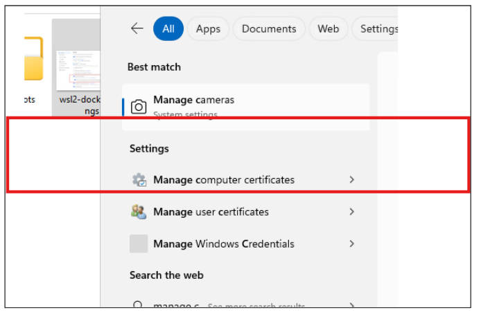
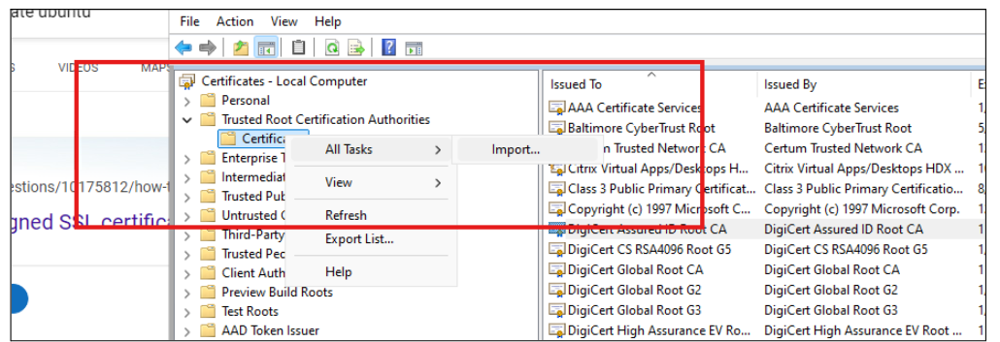
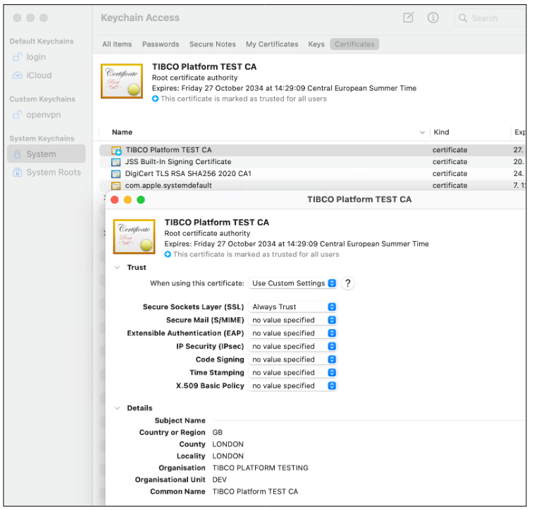

## Setup Certificate for Ingress

This section assumes you will need to use a self signed server certificate.  If you have the ability to get a valid certificate that works in your environment then you can skip the certificate creation part.
The used common DNS entry used in this (local) certificate is 'localhost.dataplanes.pro'. While setting up the TIBCO platform in a local environment the DNS entry used during platform configuration needs to be synchronised with the one used in this certificate. Both Platform configuration and/or certificate configuration can be changed.

### Setup environment

Create two directories, 'cert' and 'certconf', to hold the certificate configuration and a directory where the certificates will be created.

| Directory | File | Description |
| :---- | :---- | :---- |
| certs |  | target directory where the SSL certificates will be created |
| certconf | server-tibco-plat.cnf | SSL Configuration when creating certificate request |
| certconf | server-tibco-plat.ext | SSL Configuration that contains the SANs used in the host examples in this article. |

### Server Certificate Configuration file

Create a configuration file called server-tibco-plat.cnf that will be used by openSSL to create your server certificate with the details shown below.  For simplicity all the hostnames for each of the capability profiles have been added to this config file.  There is no harm in keeping them but they can be removed if required.   The amount of SANS might seem excessive but this is to deal with systems that do not support wildcard DNS and where to be explicit when referencing a specific capability.  

#### file: server-tibco-plat.cnf
created in the certconf directory

```
[ req ]
prompt                 = no
days                   = 365
distinguished_name     = req_distinguished_name
req_extensions         = v3_req


[ req_distinguished_name ]
countryName            = GB
stateOrProvinceName    = LONDON
localityName           = EAST
organizationName       = TIBCO PLATFORM
organizationalUnitName = DEV
commonName             = localhost.dataplanes.pro
emailAddress           = emailaddress@myemail.com

[ v3_req ]
basicConstraints       = CA:false
extendedKeyUsage       = serverAuth
subjectAltName         = @sans

[ sans ]
DNS.1 = *.localhost.dataplanes.pro
```

#### file: server-tibco-plat.ext
created in the certconf directory
```
authorityKeyIdentifier=keyid,issuer
basicConstraints=CA:FALSE
keyUsage = digitalSignature, nonRepudiation, keyEncipherment, dataEncipherment
subjectAltName = @alt_names

[alt_names]
DNS.1 = *.localhost.dataplanes.pro
```

### Create CA certificate

In the WSL or directly on Mac run the following commands, from the cert directory,  to create a self signed certificate authority.  

```bash
openssl req -x509 -newkey rsa:4096 -keyout ca-tibco-plat.key -outform DER -out ca-tibco-plat.crt -sha256 -days 3650 -nodes -subj "/C=GB/ST=LONDON/L=EAST/O=TIBCO PLATFORM TESTING/OU=DEV/CN=TIBCO Platform TEST CA"
```

Convert the binary encoded CA CRT file into a PEM file

```
openssl x509 -in ca-tibco-plat.crt -inform DER -out ca-tibco-plat.pem -outform PEM
```

### Create Server Certificate

```
openssl genrsa -out server-tibco-plat.key 4096

openssl req -new -config ../certconf/server-tibco-plat.cnf -key server-tibco-plat.key -out server-tibco-plat.csr -outform PEM
openssl x509 -req -in server-tibco-plat.csr -CA ca-tibco-plat.crt -CAkey ca-tibco-plat.key -CAcreateserial -outform PEM -out server-tibco-plat.pem -days 825 -extfile ../certconf/server-tibco-plat.ext
```

### Combine the CA Authority and Server PEM files 

Combine the CA Authority PEM and the Server PEM file into a single chained PEM file that will be used to create the kubernetes secret.

Warning:  Do not switch the server and certificate authority parts around below.  The order is critical for how the file is then loaded into kubernetes.  Many tears have been shared online for those that have.  

```
cat server-tibco-plat.pem ca-tibco-plat.pem >> server-tibco-plat-chain.pem
```

### Create a Kubernetes Secret that will be used by NGINX

```
kubectl create namespace ingress-nginx
```

```
kubectl create secret tls server-tibco-plat --key server-tibco-plat.key --cert server-tibco-plat-chain.pem -n ingress-nginx
```


<br><br>
---

### Add the CA certificate to your OS

**Windows**

In the windows search box type “Manage computer certificates” and select “Manage computer certificates”.  



Import the CA certificate that was created by openSSL  Trusted Root Certification Authorities




**Mac OS**

```
sudo security add-trusted-cert -d -r trustRoot -p ssl -k /Library/Keychains/System.keychain ca-tibco-plat.pem
```

To Validate the certificate open the Keychain Access application and open the certificate to validate that SSL is Always trusted. 



## Build a Custom Truststore 

Some Java tools, such as Maven will require a custom trust store which includes the CA certificate we generated in the previous steps.  To import the certificate follow these steps.

Ensure your JAVA\_HOME environment setting is set to point to the correct JAVA Runtime environment

Make a backup of your java runtime cacerts file.

**Windows OS**

```
cp $env:JAVA_HOME\lib\security\cacerts 
$env:JAVA_HOME\lib\security\cacertsbackup
```

**Mac OS**

```
cp $JAVA_HOME/lib/security/cacerts  $JAVA_HOME/lib/security/cacertsbackup
```

Import the TIBCO platform test certificate into your java runtime cacerts file.   If prompted for a password then the default password for certificate stores is normally changeit.  

```
keytool -import -trustcacerts -alias tibco-plat-test -file [project dir]ca-tibco-plat.crt -keystore cacerts
```
