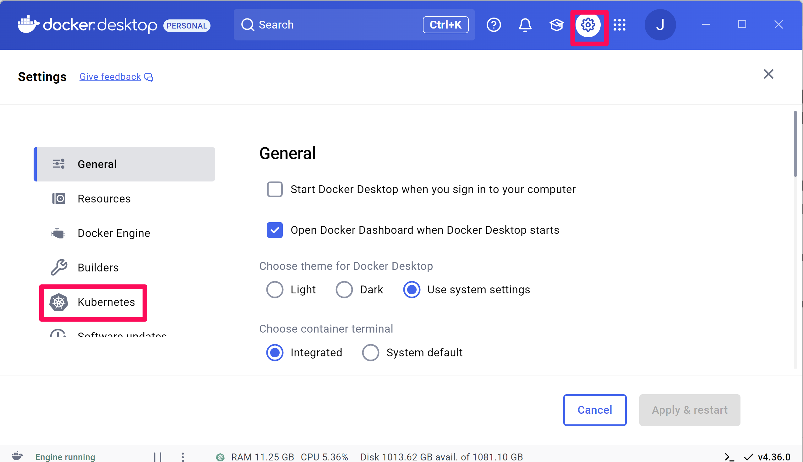
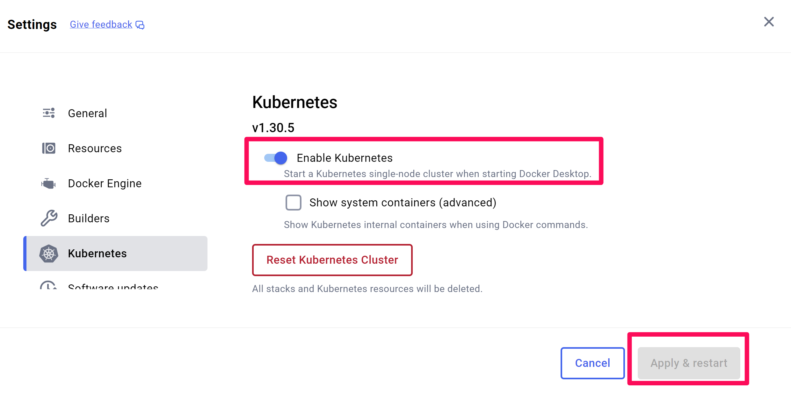
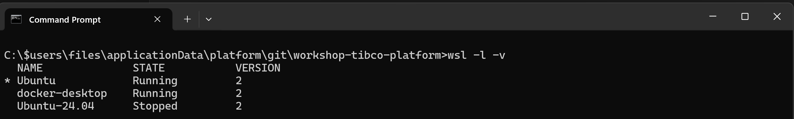

# Install docker desktop on WSL 

The following steps need to be taken to install Docker Desktop on WSL:

Prerequisite: 
1) Have Visual Studio Code installed on Windows. If it is not installed, do so. See for details: https://code.visualstudio.com/download
2) Have Windows Subsystem 2 for Linux installed. If you don't have it installed / enabled, please do so. See for details [here](install-wsl.md).
3) Have the WSL extention for Visual Code installed. See for details: https://marketplace.visualstudio.com/items?itemName=ms-vscode-remote.remote-wsl


## Step 1: Install Docker Desktop for Windows Subsystem for Linux (WSL)

See for detailled instructions [here](https://docs.docker.com/desktop/setup/install/windows-install/). Please mind: use an installation on WSL, NOT on Hyper-V.

## Step 2: Enable Kubernetes on Docker Desktop

Step 2.1: Open Docker Desktop and click Click settings --> Kubernetes


Step 2.2: enable kubernetes
1. Set 'enable Kubernetes' en click 'Apply & Restart'

2. Wait for Kubernetes to start.

Please mind: if you previously used kubernetes, you can refesh the setup by clicking the button 'reset kubernetes cluster'.

Step 2.3: Test kubernetes
1. Open a command prompt and type 'kubectl get namespaces'. 
2. Check if you get a list of available namespaces.

## Step 3: Prepare the Ubuntu image
The (standard) Ubuntu image provided as part of WSL will be used to run the installation script. In order to do so, a number of modifications need to made.

Step 3.1: Check if the standard WSL Ubuntu ../images is installed. 

1. Open a windows terminal
2. Run the following command

```windows terminal
wsl -l -v
```


1. Make sure the standard ubuntu image is listed:


If it is not, run the following command
```windows terminal
wsl -l -o
```

2. Check to make sure Ubuntu is in the list.

Install the image with the following command
```windows terminal
wsl --install -d Ubuntu
```

Step 3.2 Login to the Ubuntu WSL image
1. Run the following command
```windows terminal
wsl -d ubuntu 
```
2. Go to your home directory
```bash
cd ~ 
```

3. Create a work directory named 'tibcoplatform'
```bash
mkdir tibcoplatform
cd tibcoplatform 
```

Step 3.3 Install required software

1. Check if 'git' is installed
```bash
git --version
```

2. If it isn't, install it with the following commands:
```bash
sudo apt update
sudo apt install git
```

3. Check if kubectl is installed
```bash
kubectl version
```

4. If it is not installed, install it:
```bash
sudo apt update
sudo apt install kubectl
```

5. Check if helm is installed
```bash
helm version
```

6. If it is not installed, install it:
```bash
sudo apt update
sudo apt install helm
```

7. Check if yq is installed
```bash
yq version
```

8. If it is not installed, install it:
```bash
sudo apt update
sudo apt install yq
```
