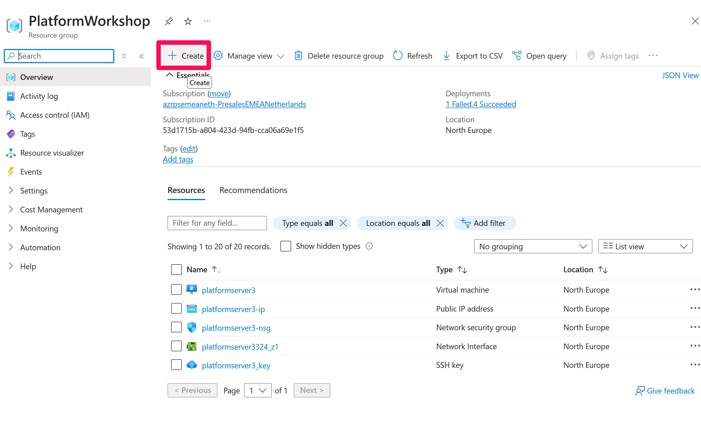
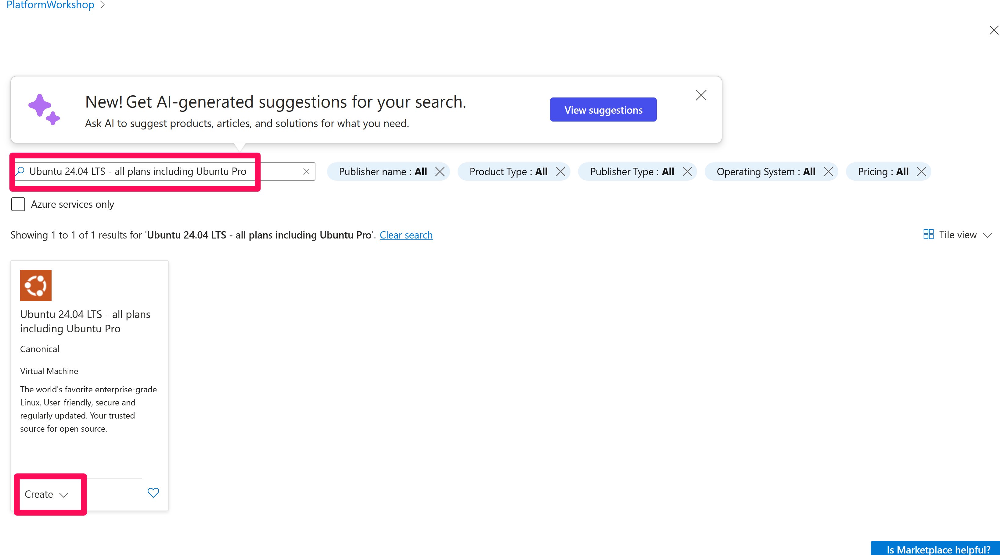
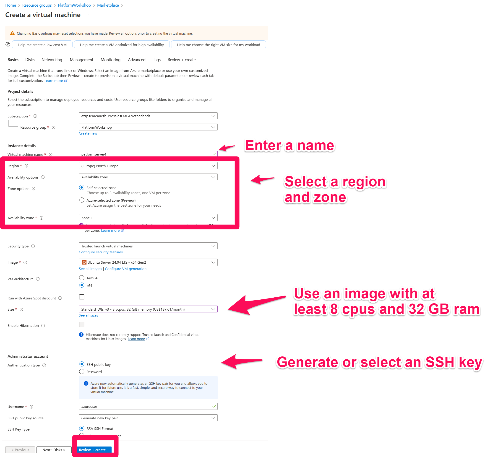
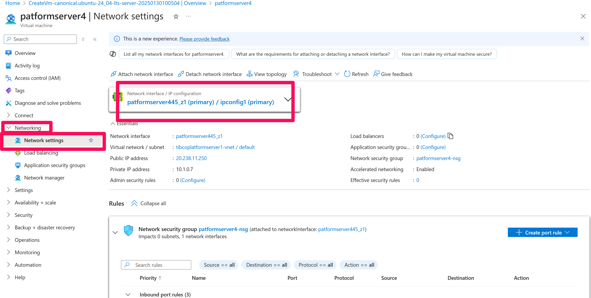
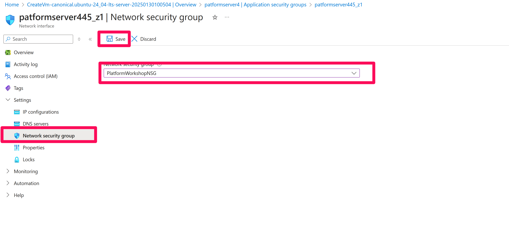
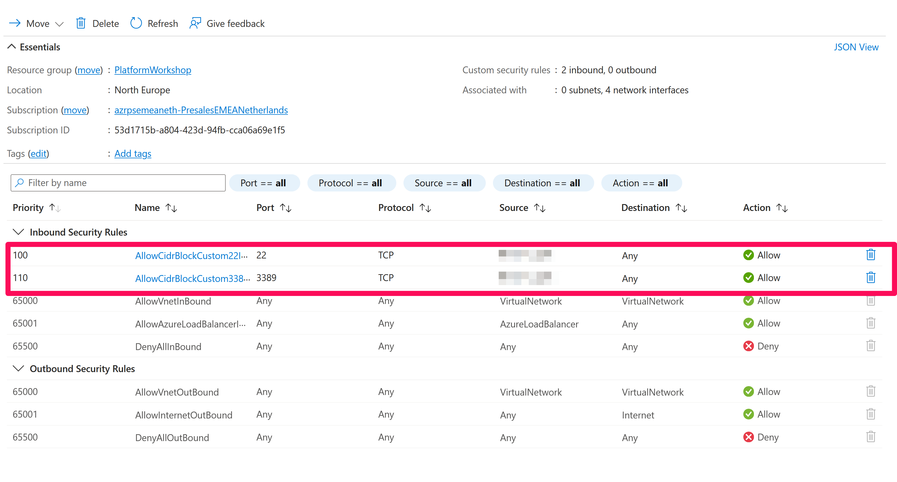

# Install Ubuntu on Azure

An Ubuntu image on Azure can be used as the base platform for TIBCO platform. This document contains an installation description.

Requirements:
At least 8 cores
At least 16 GB of ram

## Step 1: Login to the Azure portal
Login to the Azure portal at https://portal.azure.com

## Step 2: Create an Ubuntu server
Step 2.1: Click on the resource group button and select the resource group that you want to use. If neccessary create a new resource group.<br>


Step 2.2: Click the create button<br>


Step 2.3: Ubuntu Server 24.04 LTS - x64 Gen2 <br>


Step 2.4: Configure the Ubuntu server as shown in the figure below<br>


Step 2.5: Review the server configuration and if needed download the SSH key

## Step 3: Whitelist your workstation to be able to connect to the server
Next we will setup a SSH connection to the server

Step 3.1: Whitelist the IP address that you want to use to access the server

Step 3.1a: Click networking --> network settings and select the network card<br>


Step 3.1b: Select the network security group <br>
1. Select network security group
2. Select the group to be used (or create a new group)
3. Click 'save'


Step 3.1c: Whitelist the IP address of your workstation <br>
1. Open the network security group (it is located in the resource group)
2. Whitelist the IP address of your workstation for the ports 22 (ssh) and 3389 (RDP)




## Step 4: Create an SSH connection to the server

Create a putty configurtion for your server. See for a description [here](https://k21academy.com/microsoft-azure/admin/how-to-create-and-connect-an-ubuntu-virtual-machine-in-azure/). (See the section 'Connecting to Ubuntu Virtual Machine').

## Step 5: Install GNOME and XRDP
In this step we will install the XRDP service and the GNOME GUI, which will enable users to login via Windows Remote Desktop.

Step 5.1: Login to the server via SSH (Putty). See for details the previous step.

Step 5.2: Install Gnome

```bash
sudo apt update
sudo apt install gnome gnome-shell 
sudo apt install gdm3
```

Step 5.3: Start GNOME
```bash
sudo systemctl start gdm3.service
sudo dpkg-reconfigure gdm3
```

Step 5.4: Install xrdp
```bash
sudo apt-get -y install xrdp
sudo systemctl enable xrdp
```

Step 5.5: Configure additional security settings

```bash
sudo adduser xrdp ssl-cert
sudo adduser tibco
sudo bash -c 'echo "tibco ALL=(ALL:ALL) ALL" >> /etc/sudoers'
```

Step 5.6: Restart xrdp
```bash
sudo systemctl restart xrdp
```


