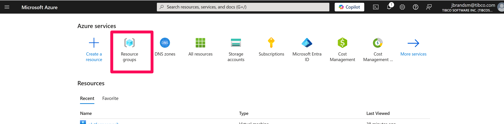

# Install Ubuntu on Azure

An Ubuntu image on Azure can be used as the base platform for TIBCO platform. This document contains an installation description.

Requirements:
At least 8 cores
At least 16 GB of ram

## Step 1: Login to the Azure portal
Login to the Azure portal at https://portal.azure.com

## Step 2: Create an Ubuntu server
Step 2.1: Click on the resource group button and select the resource group that you want to use. If neccessary create a new resource group.

Step 2.2: 
