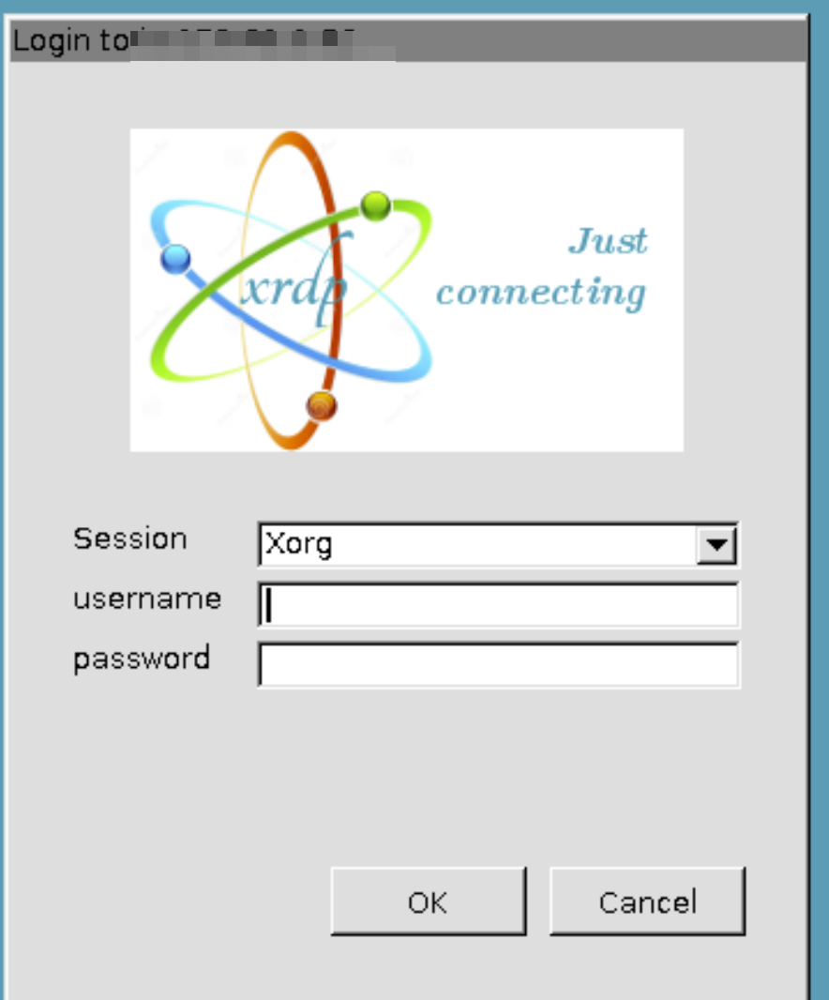

# Login to an ubuntu instance on Aws or Azure

In order to be able to login an ubuntu instance on AWS or intall or use the TIBCO platform a Remote Desktop Connection must be used. If Remote Desktop is not installed on your client, install it first:

[Install on Windows](https://learn.microsoft.com/en-us/windows-server/remote/remote-desktop-services/clients/uninstall-remote-desktop-connection?tabs=gui).
[Install on Mac](https://support.apple.com/en-gb/guide/remote-desktop/apdf49e03a4/mac).

## Step 1: Configure Remote Desktop
A number of configuration settings need to be applied:

Step 1.1: Start Remote Desktop

Step 1.2: Set the resolution

Step 1.2a: Click 'Show Options' 

Step 1.2b: Ajust the resulution 
1. Click 'Display'
2. Select a lower resultion 
 
Remark: it is possible to keep the resulution the same as the resulution of your computer. This may not work in all cases or it may lead to an unreadable screen.

Step 1.2c: Enable copy-paste in RDC.
1. Click 'Local Resources'
2. Select 'On the Remote Computer'  

Step 1.2c: Restore the RDC client. 
1. Click 'general'
2. Click 'hide options' 

## Step 2: Connect
Connect to the remote Ubuntu image using the following steps:
 
Step 2.1: Connect to the Ubuntu image:
1. Enter the hostname (or IP address) of the remote Ubuntu server.
2. Click 'Connect'  

 
Remark: Please make sure the IP address to be used is whitelisted in AWS or Azure.
 
If the following warning is shown, click 'yes' 

Step 2.2: Login with the credentials provided: 

Step 2.3: Login again  

Step 2.4: Open a terminal 
Select Applications --> Terminal Emulation  
