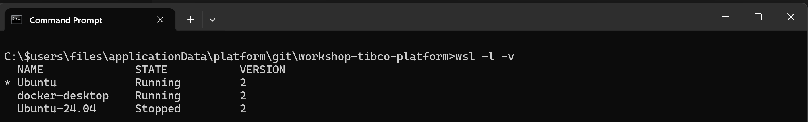

# Login to Ubuntu on WSL

Use the following steps to login to Ubuntu on WSL

## Step 1: Login to  Ubuntu on WSL

Step 1.1: Open a command prompt

Step 1.2: Type the following command to get an overview of the installed WSL images
```windows terminal
wsl -l -v
```


Step 1.3: Start the Ubuntu image of your choice

```windows terminal
wsl -d <DistroName>
```
This will open a Ubuntu prompt


