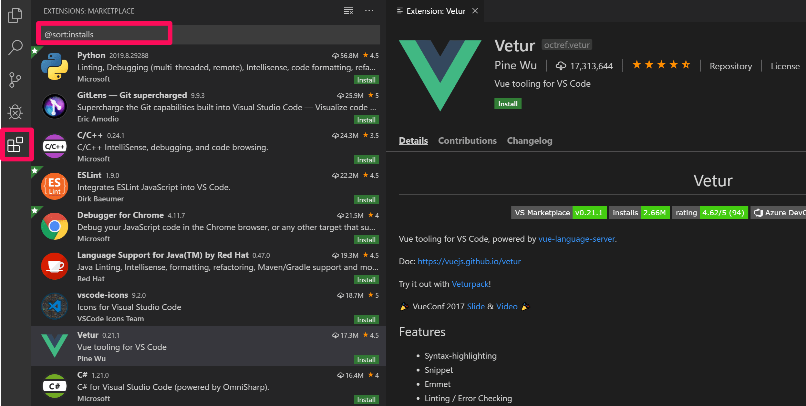

# Prepare Platform Deployment

Before installing the TIBCO Platform, a couple of preparations must be carried out: 


## Step 1: Install minikube
Run the following commands to install minikube

```bash
curl -LO https://storage.googleapis.com/minikube/releases/latest/minikube-linux-amd64
sudo install minikube-linux-amd64 /usr/local/bin/minikube && rm minikube-linux-amd64
```

## Step 2: Install required software
Install required software.

Step 2.1: Run the following commands to install required software:

```bash
sudo snap install yq
sudo snap install helm --classic
sudo snap install kubectl --classic
```

Step 2.2: Install Visual Studio. 

For AWS and Azure run the following command:

```bash
sudo snap install code --classic
```

For WSL install Visual Code install:
1. Visual Studio Code (for Windows or Mac). See [here](https://code.visualstudio.com/download).
2. Startup Visual Studio Code and install the plugins 'Kubernetes Plugin'. 




## Step 3: Install docker engine

Step 3.1: Prepare installation

```bash
# Add Docker's official GPG key:
sudo apt-get update
sudo apt-get install ca-certificates curl
sudo install -m 0755 -d /etc/apt/keyrings
sudo curl -fsSL https://download.docker.com/linux/ubuntu/gpg -o /etc/apt/keyrings/docker.asc
sudo chmod a+r /etc/apt/keyrings/docker.asc

# Add the repository to Apt sources:
echo \
  "deb [arch=$(dpkg --print-architecture) signed-by=/etc/apt/keyrings/docker.asc] https://download.docker.com/linux/ubuntu \
  $(. /etc/os-release && echo "$VERSION_CODENAME") stable" | \
  sudo tee /etc/apt/sources.list.d/docker.list > /dev/null
sudo apt-get update
```

Step 3.2: Install Docker engine

```bash
sudo apt-get install docker-ce docker-ce-cli containerd.io docker-buildx-plugin docker-compose-plugin
```

If requested to restart service

```bash
Restarting services...


Daemons using outdated libraries
--------------------------------

1. networkd-dispatcher.service  2. unattended-upgrades.service

(Enter the items or ranges you want to select, separated by spaces.)

Which services should be restarted?
```
Choose '1,2' (and press enter)


Step 3.3: Configure security

```bash
sudo usermod -aG docker $USER
newgrp docker
```


## Step 4: Start the Minikube cluster
Run the following command:

```bash
minikube start --cpus 8 --memory 24576 --disk-size "40g" \
--driver=docker --addons storage-provisioner \
--kubernetes-version "1.32.0" --extra-config=kubelet.max-pods=500
```

Please mind: 
(1) If you have more processors and ram, modify the parameters --cpu and --memory, but always leave 8 GB of ram for other purposes. One may want also to change the kubernetes version to the version is aligned with the required version in the target platform version.


## Step 5: Increase the maximum number of files for the current user


```bash
sudo sh -c 'echo "fs.inotify.max_user_watches = 524288\nfs.inotify.max_user_instances = 8192" > /etc/sysctl.d/inotify.conf && sysctl -p /etc/sysctl.d/inotify.conf'
sudo sysctl -p /etc/sysctl.d/inotify.conf
```


## Step 6: Create a work directory
Run the following command to create a workdirectory:

```bash
mkdir -p ~/projects/platform-dev
cd ~/projects/platform-dev
```

