# Configure the platform 

This document contains a description on how to configure a sandbox instance of TIBCO Platform (Control Plane and Data Plane).

The configuration of the platform involves the following steps:

Step 1: Opening of the administrator GUIs
Step 2: Create a platform administrator
Step 3: Create a subscription
Step 4: Create users in the subscription
Step 5: Configure the Data Plane
Step 6: Register the Data Plane


## Step 1: Open the administrator GUIs


Step 1.1: Open the mail environment
During the configuration of the platform a number of mails are sent (to newly created users). In order to facilitate this process in the sandbox environment a mail server is provisioned.


Open the following URL in a webbrowser in Windows: https://mail.localhost.dataplanes.pro/

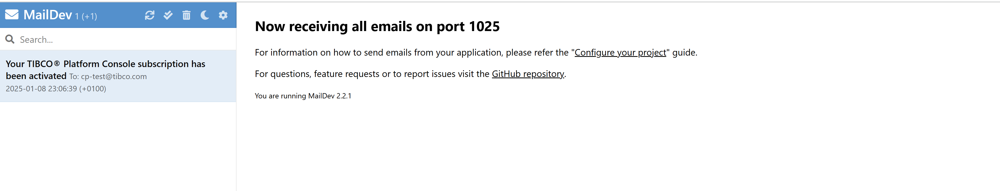

Step 1.2: Open the platform console
The Control Plane has web GUI.

Open the following URL in a webbrowser in Windows: https://admin.cp1-my.localhost.dataplanes.pro/

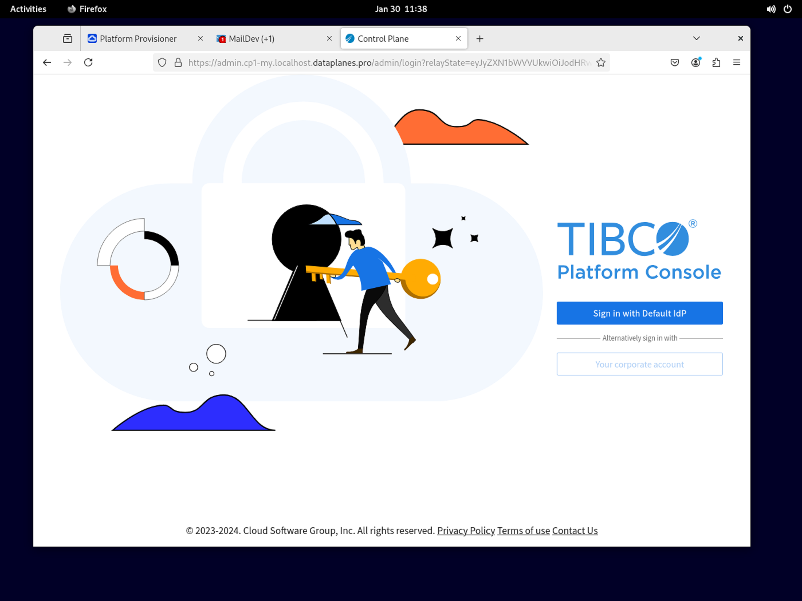


## Step 2: Create a platform administrator

Every TIBCO platform has one platform administrator. This is the 'super user'. In this step we will create the platform administrator.

Step 2.1: Create a platform administrator

The mail server contains a mail to the platform administrator. Open this mail and click the 'sign in' button.

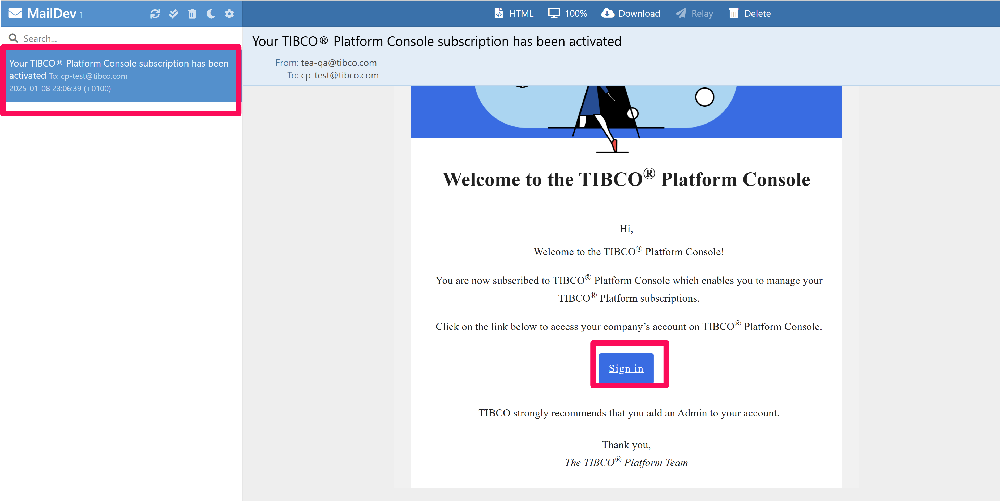

Step 2.2: Register the subscription owner

Provide the user data from the subscription owner. Please mind: the email address can not be changed.
Use a password that meets the requirements (for exmple 'Platform@123'). Click the 'submit' button.

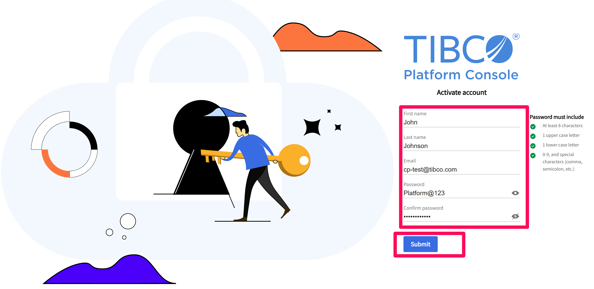

Step 2.3: Login with the default idp

Go to the platform console and click the button 'sign in with default idp'. Use the credentials you entered in step 2.2.


## Step 3: Create a subscription
A TIBCO platform contains one or more subscriptions. Every subscription has it's own security context. Every subscription has it's own set with users (or it's own IdP).
Subscriptions are generaly created for an organisation or an organisation unit.


Step 3.1: Create a new subscription
a) Click (in the navigator on the left) on 'subscriptions' and click the button 'Provision via wizzard'

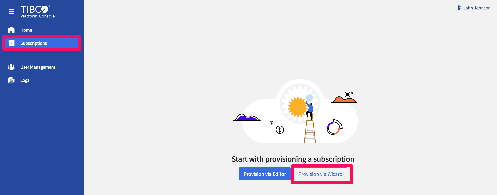

b) Enter the data of the administrator of the subscription and click the button 'next'. Make note of the email address used.

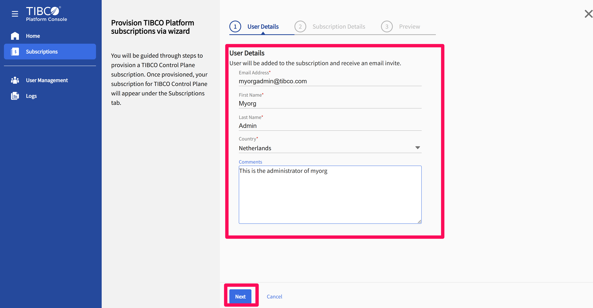

c) Configure the subscription. Provide the following:

- Choose a name for your organisation.
- Enter the prefix of the hostname of the control plane. Use: myorg
- Pick 'Use defailt IdP'
- Keep the provided container registry entries unchanged. 

Click the 'next' button.

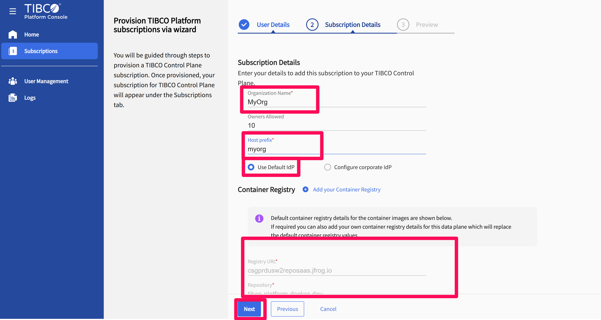


d) Review the data and click the 'OK' button

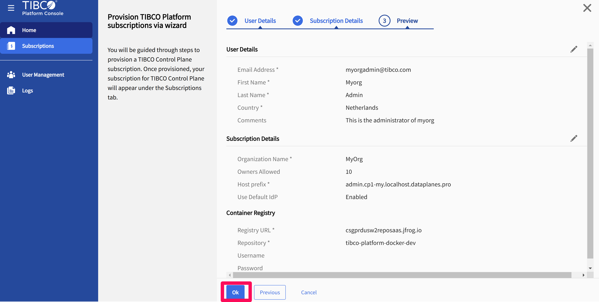

For more information see: [here](https://docs.tibco.com/pub/platform-cp/1.3.0/doc/html/Default.htm#Administration/Provisioning-subscription-via-Wizard.htm?TocPath=TIBCO%2520Platform%2520Console%257CProvisioning%2520a%2520Subscription%257C_____2)

Please notice that the subscription is now added the the control plane.

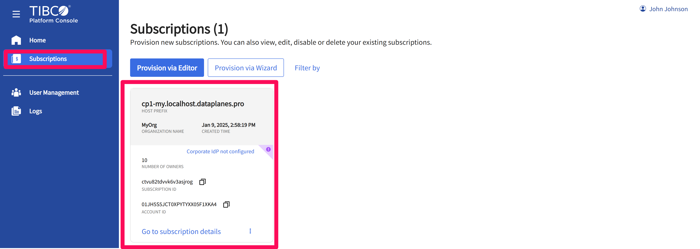

## Step 4: Login to the subscription
As a next step, it is time to configure the new subscription and to create new users


Step 4.1: Set a password for the administrator created in step 3.

a) Open an NEW browser (use a different browser, not the browser used for step 3) and open https://myorg.cp1-my.localhost.dataplanes.pro/, click on the button 'Sign in with Default IdP'.

Please mind: we will use two browser from here on:
(1) A browser for the platform (https://admin.cp1-my.localhost.dataplanes.pro/)
(2) A browser for the subscription (https://myorg.cp1-my.localhost.dataplanes.pro/)

Don't mix these two environments in one browser!

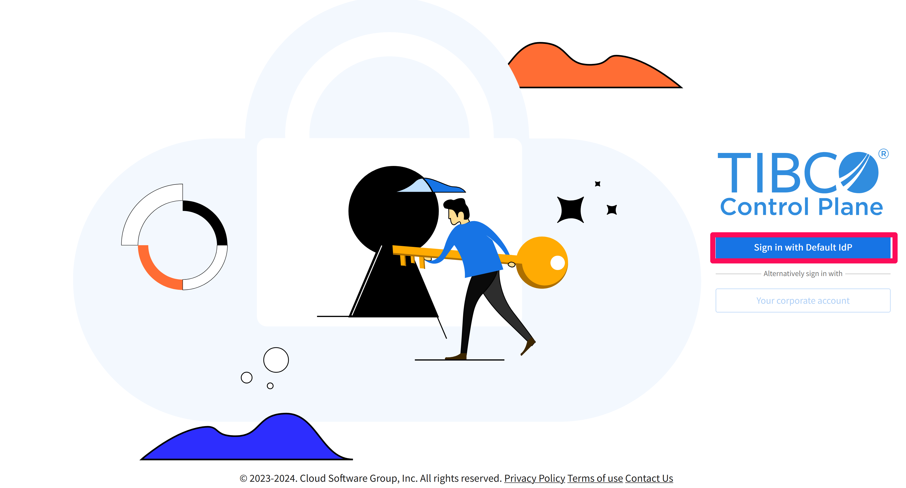

b) Click on 'Forgot Password'

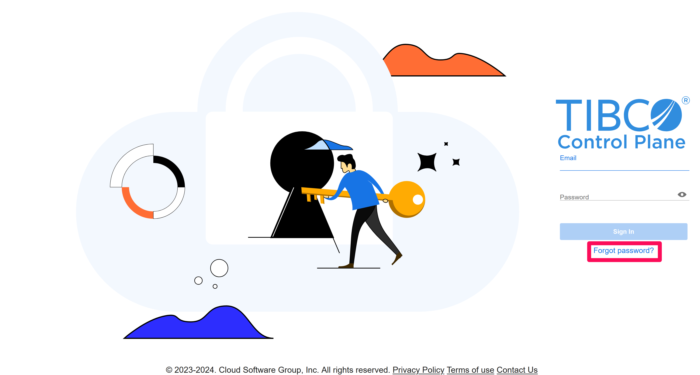

c) Enter the e-mail address used for the administrator of the subscription in step 3 and click 'Request Reset Link' button.
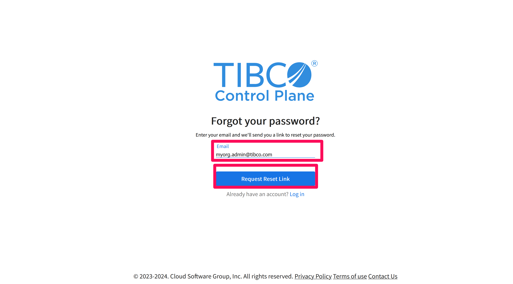

d) Return to the web gui of the mail server. A reset password mail is available. Open this mail and !RIGHT click! on the button 'reset password' and copy the link to clipboard.

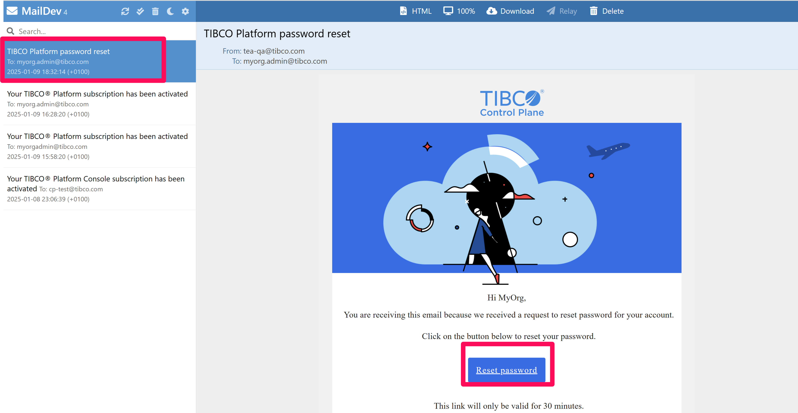

e) Go back the subscription browser in which you opened https://myorg.cp1-my.localhost.dataplanes.pro/. 

f) Create a new tab and open the link you copied in step (d).
Enter a new password (twice) and clikc the button 'Reset Password'.

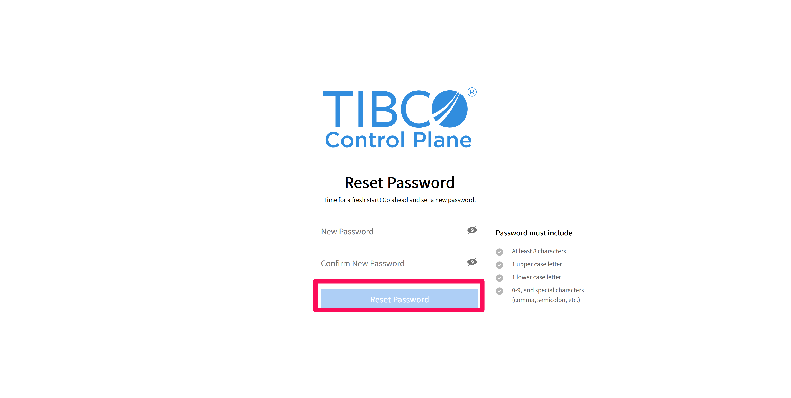


Step 4.2: Login to the subscription.

a) Open https://myorg.cp1-my.localhost.dataplanes.pro/ in the browser window. click on the button 'Sign in with Default IdP'.


b) Use the email adress registered in step 3 to login to the subscription. 

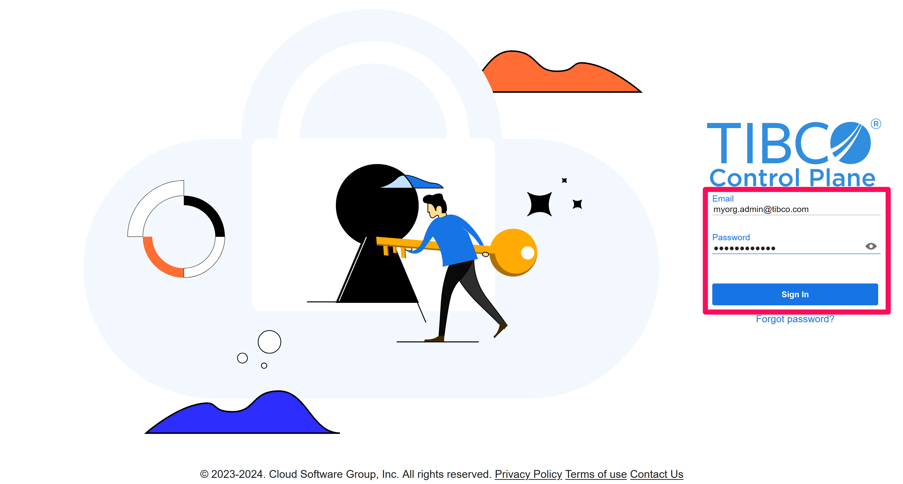


Click User Management --> Users
Please note that the subscription only has one user (the administrator created in step 3). If you want, you can add more users now.

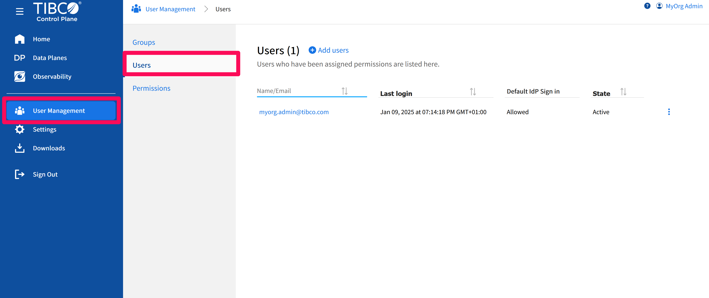

Step 4.2: Update permissions

a) Select the dots behind the administrator and select 'update permissions.

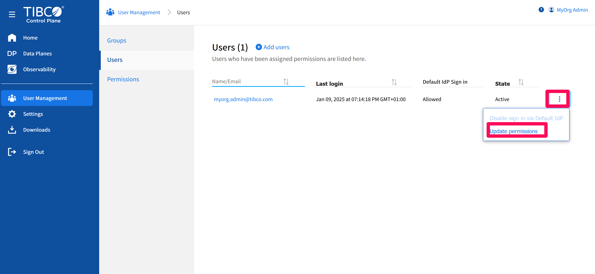

b) Select each of the permisions and check the box 'grant permission'.
After that click 'next'.
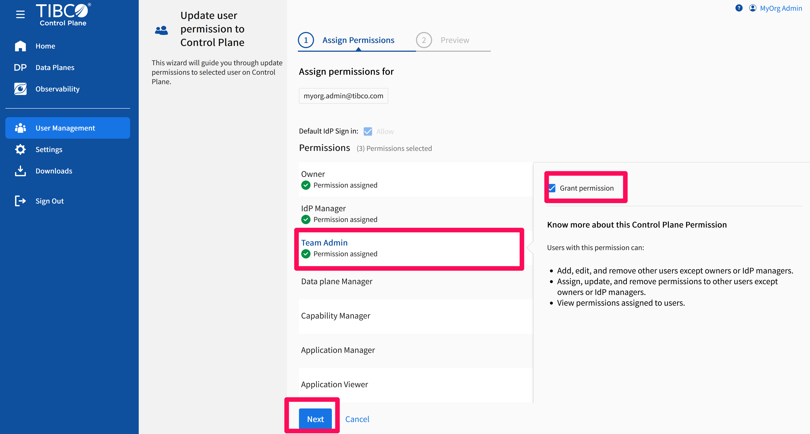


c) Click the button 'update permissions'.
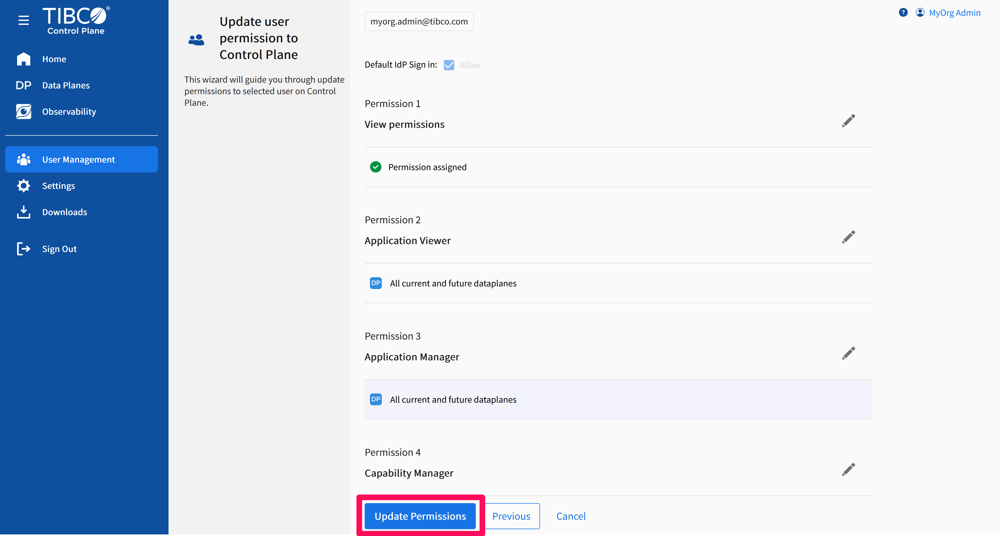

## Step 5: Configure the Data Plane

Step 5.1: Register the data plane
a) Click 'Data Planes' --> 'Register a Data Plane'

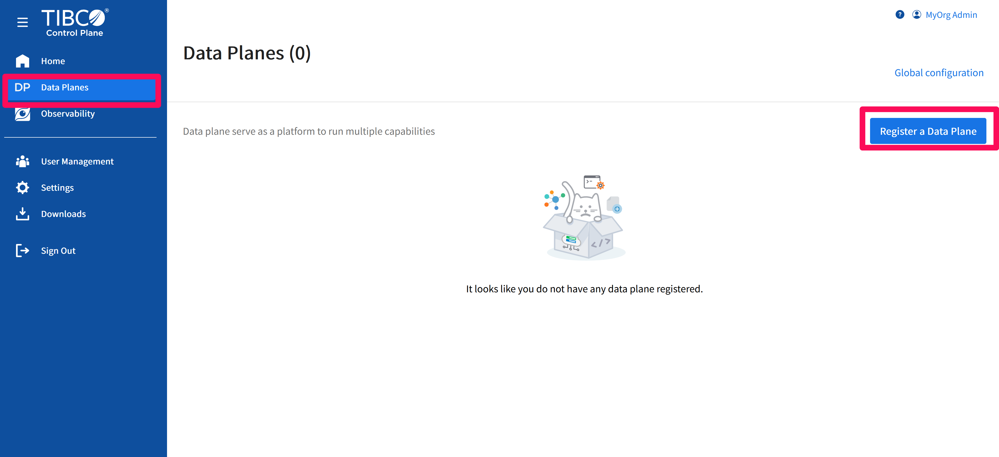

b) Click on the 'start' button for an existing kubernetes cluster
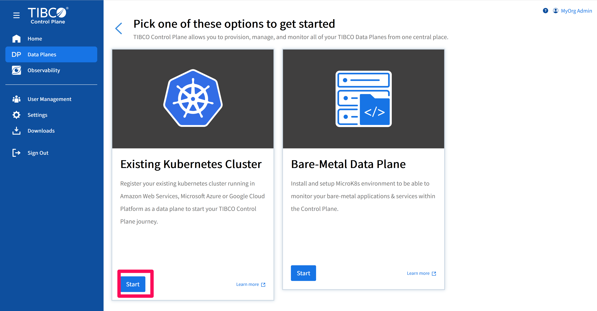

c) In the configure data plane menu fill out the following:
- Provide a name and a description of the Data Plane.
- Despite the fact that we will configure a local Data Plane, please select Azure and an arbitrary region.
- Check the EUA-box 
- Click the 'next' button
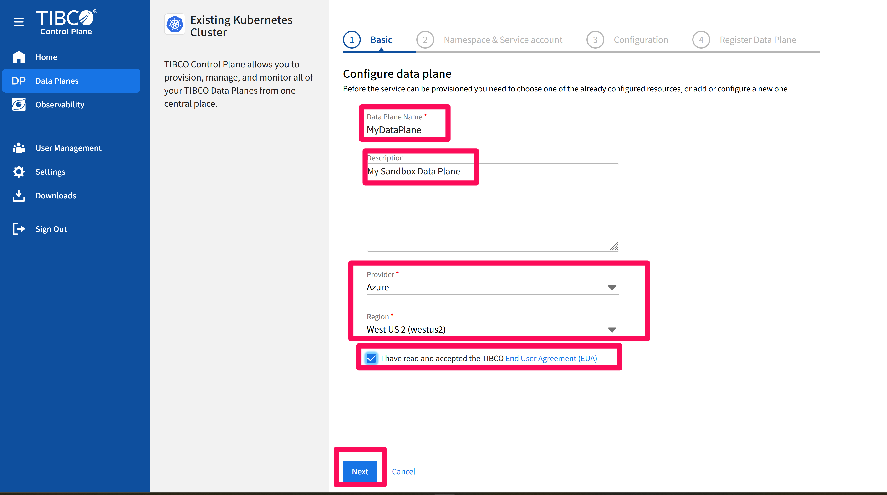

d) Configure a name space and a service account.

The dataplane is provisiond in a namespace. We will create a new namespace for that. It is possible to use an existing namespace instead. Next to that a service account needs to be defined that will be used to run TIBCO services. Also here we will create a new service account.
Configure the settings as follows:
- Define the name of a new namespace
- Define a new service account name
- Check 'Allow cluster scoped permissions'
- Click 'next'

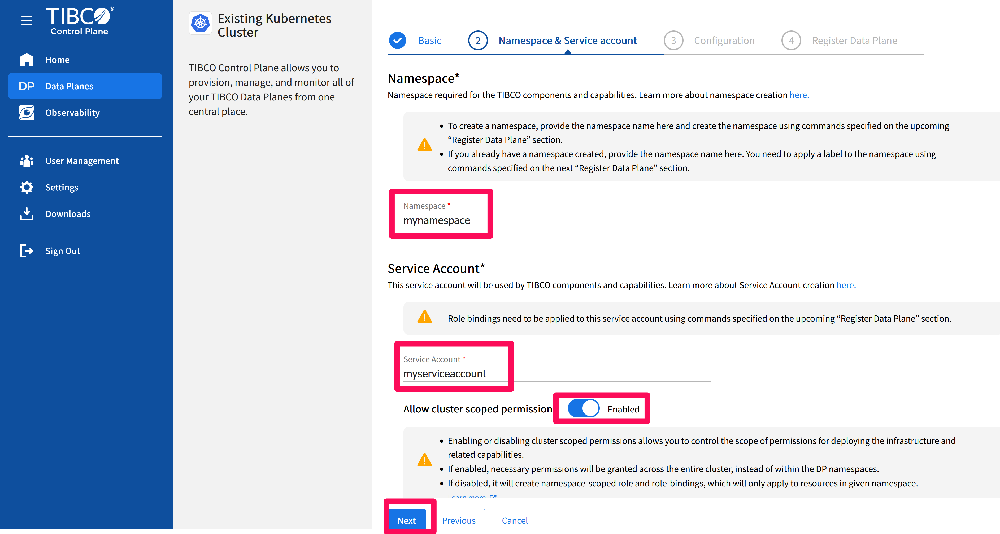

e) Configure the logging setting
The Logs Processing menu is used to configure logging. Lead the settings 'as is' and click 'next'.

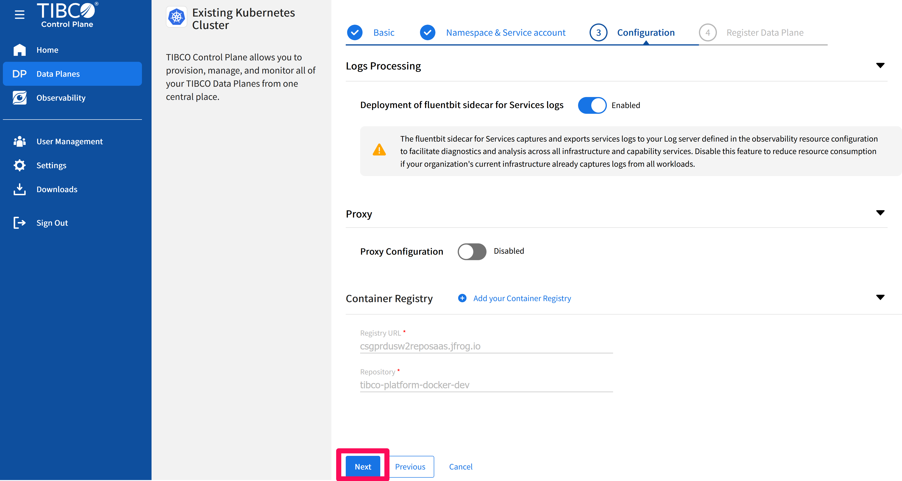


## Step 6: Register the Data Plane
As a final step the Data Plane needs to be configured.

Step 6.1: Open the WSL Ubuntu image
As part of the registration of the Data Plane, the K8s cluster needs to be configured. We will do so from the bash shell in the WLS Ubunti image.
Therefore do the following:
a) Open a windows terminal
b) Run the following command

Run the following command:
```windows terminal
wsl -d tibcoplatform
```

You now opened the Ubuntu image on Windows.
c) Go to your home directory by running the following command:
```bash
cd ~
```

Step 6.2: Create a namespace in the Data Plane
Go back to your browser (with the subscription = https://myorg.cp1-my.localhost.dataplanes.pro/)

a) Copy the content of the block 'Name Space Creation' to the clipboard.

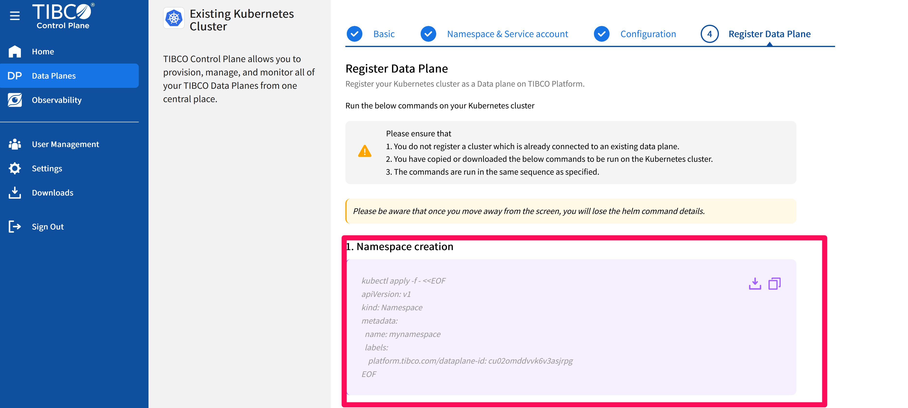

b) Go to the Ubuntu terminal and paste the command you just copied. Run it (press -enter-)

The response is supposed to be:
namespace/mynamespace created

Step 6.3: Create the service account
Go back to your browser (with the subscription = https://myorg.cp1-my.localhost.dataplanes.pro/)

a) Copy the content of the block 'Service Account Creation' to the clipboard.

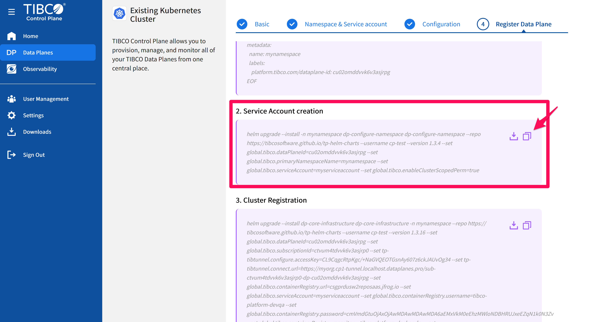

b) Go to the Ubuntu terminal and paste the command you just copied. Run it (press -enter-)

The response is supposed to be something like this:
Namespace mynamespace validation for data plane id cu02omddvvk6v3asjrpg label is successful.
Network policies creation is disabled by default.
To enable network policies creation, please use --set networkPolicy.create=true
Release name: dp-configure-namespace
To learn more about the release, try:
  $ helm status dp-configure-namespace -n mynamespace
  $ helm get all dp-configure-namespace -n mynamespace

Step 6.3: Cluster registration
Go back to your browser (with the subscription = https://myorg.cp1-my.localhost.dataplanes.pro/)

a) Copy the content of the block 'Cluster Registration' to the clipboard.

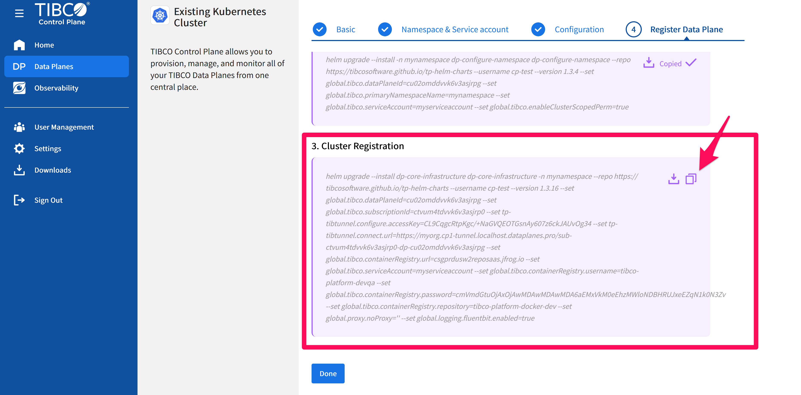

b) Go to the Ubuntu terminal and paste the command you just copied. Run it (press -enter-)

The response is supposed to be something like this:
Release "dp-core-infrastructure" does not exist. Installing it now.
NAME: dp-core-infrastructure
LAST DEPLOYED: Thu Jan  9 21:31:07 2025
NAMESPACE: mynamespace
STATUS: deployed
REVISION: 1
TEST SUITE: None
NOTES:
TIBCO Platform Data Plane Infrastructure.

c) Click the button 'Done'
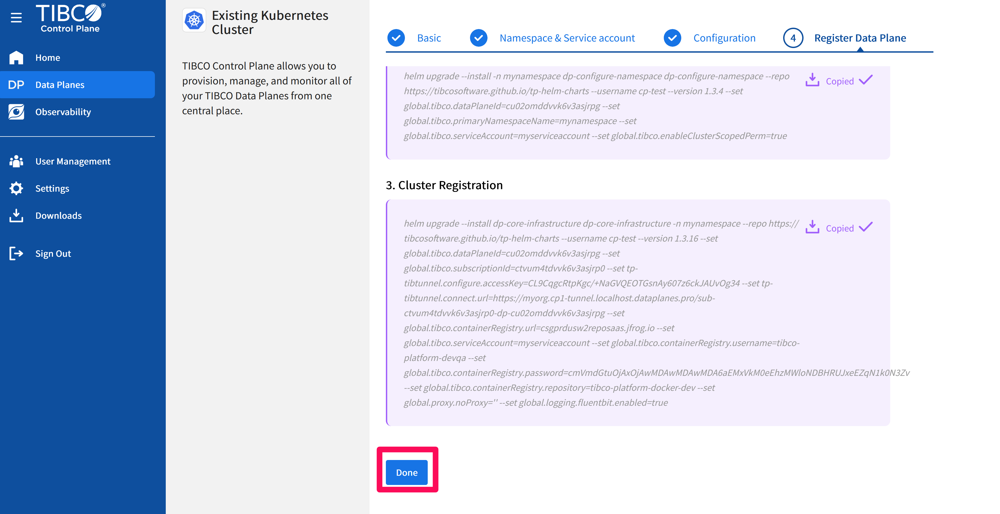

Step 6.4: Monitor the registration of the Data Plane
The registration of a new Data Plane may take a few minutes. You can monitor progress as follows:

a) Select Data Planes --> View Detailed Status

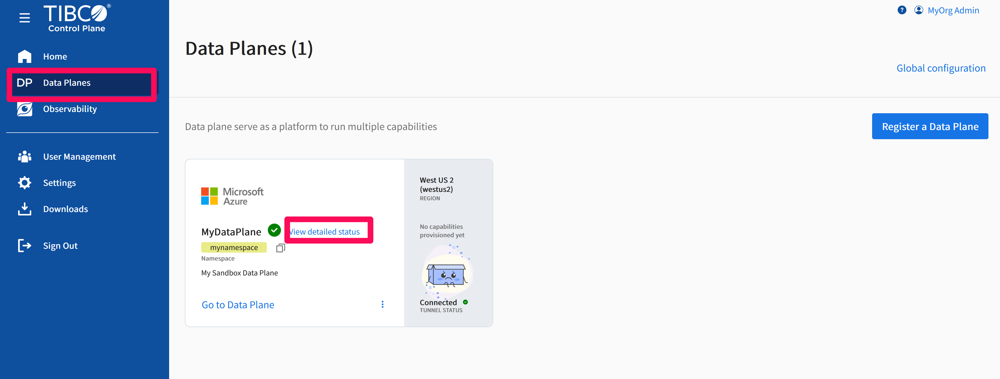

b) Select the tab 'infrastructure components'
This view shows the status of:
- the CP Proxy (used for the hybrid connection with the Data Plane)
- the Monitoring Agent (used to collect logs)
- the Observability tooling

All should be in a running (green) status
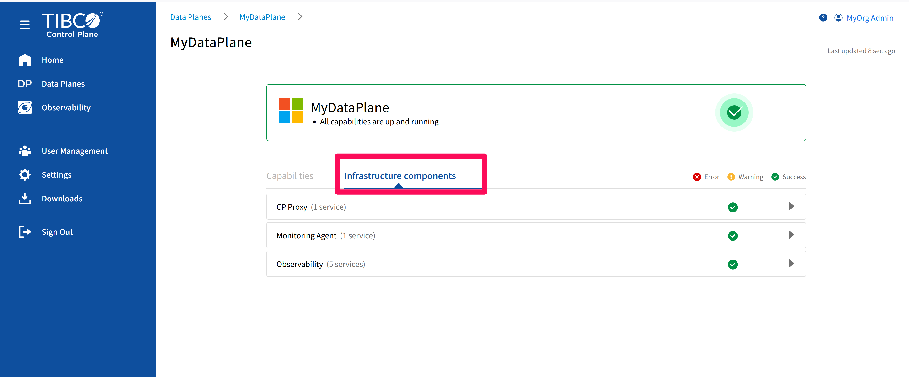
