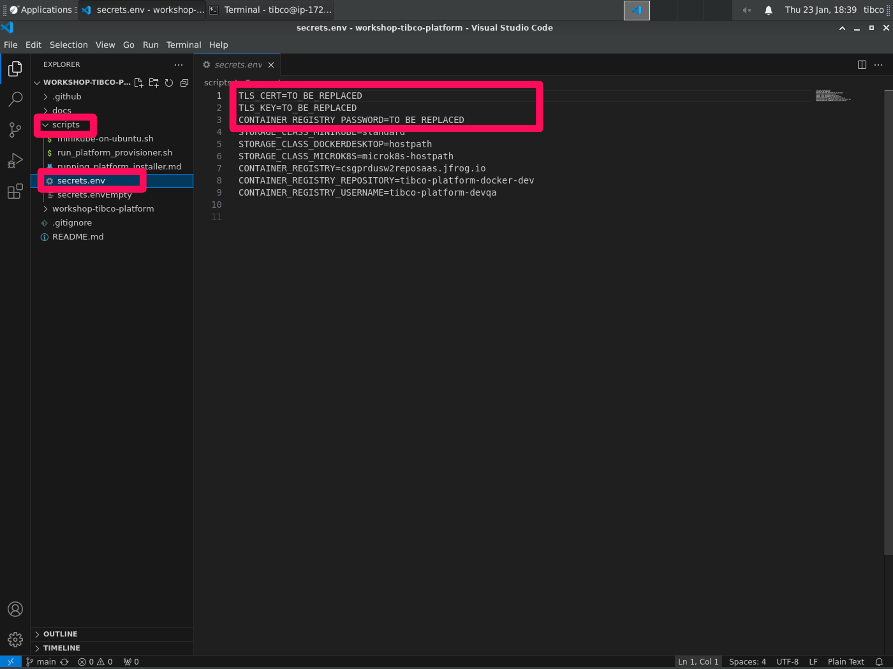
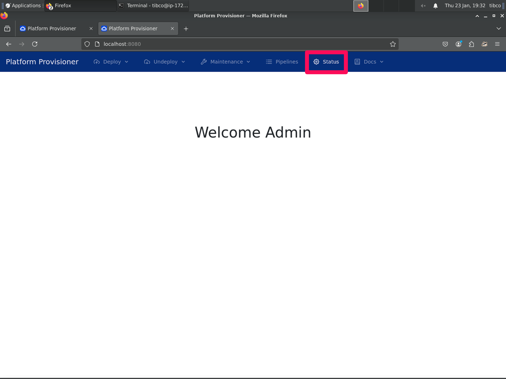
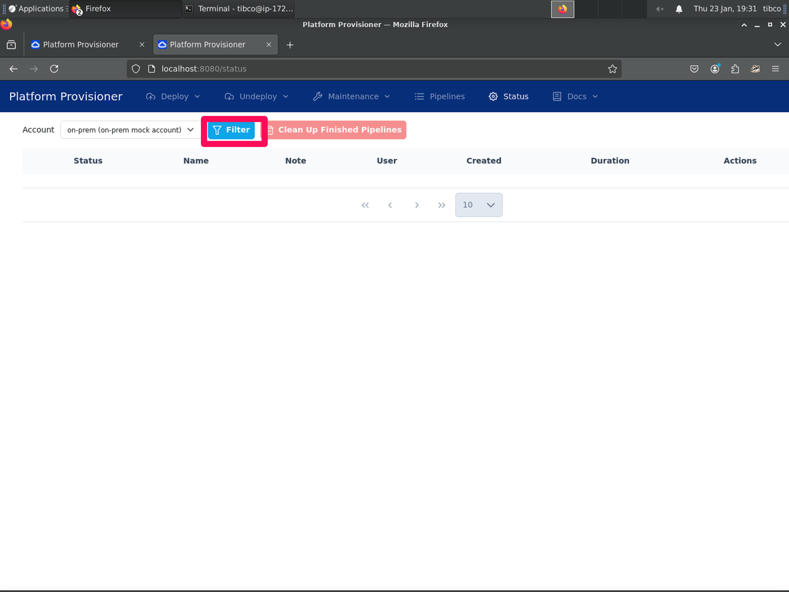
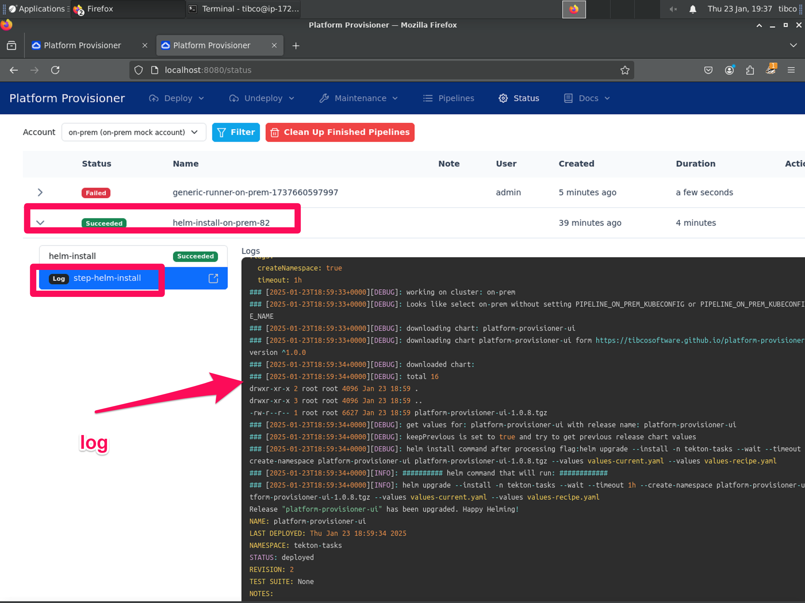

# Install the TIBCO Platform

The procedure in this document can be used to install a control plane and a data plane (part of the TIBCO Platform) on a single VM.


## Step 1: Go to the work directory


```bash
cd ~/projects/platform-dev 
```


## Step 2: Clone the GIT repository

```bash
git clone https://github.com/tibco-bnl/workshop-tibco-platform
```

## Step 3: Provide security keys

Step 3.1 Set the TLS certificates (to be used for the network tunnel between the Control Plane and the Data Plane).

Run the following to set the TLS certidicates 
```bash
cd ~/projects/platform-dev/workshop-tibco-platform/scripts
cp secrets.envEmpty secrets.env
cd ~/projects/platform-dev
chmod +x ~/projects/platform-dev/workshop-tibco-platform/scripts/generate_certs.sh
./workshop-tibco-platform/scripts/generate_cert.sh
```


Step 3.2: Open the secrets file in ~/projects/platform-dev/workshop-tibco-platform/scripts with visual code:
```bash
cd ~/projects/platform-dev/workshop-tibco-platform
code .
```


Step 3.3: 

a) Set the variable: CONTAINER_REGISTRY_PASSWORD

Values can be found in document https://docs.google.com/document/d/1f39d0_L6iRpEPjJggYFJrL3oVAtDyPdVbOnjmzU7E0E/edit?tab=t.l6dihjhx60qc#heading=h.8ir76m4dmdxu  (only for TIBCO staff)

Remark: alternatively it is possible to use publicly signed certificates instead if self signed certificates generated in step 3.1. The publicly signed certificates can be found in: https://docs.google.com/document/d/1f39d0_L6iRpEPjJggYFJrL3oVAtDyPdVbOnjmzU7E0E/edit?tab=t.l6dihjhx60qc#heading=h.8ir76m4dmdxu (TIBCO STAFF ONLY)


b) save the file
c) exit Visual Code





## Step 4: Install the data plane

Step 4.1: Run the following script

```bash
cd ~/projects/platform-dev/workshop-tibco-platform/scripts
./run_platform_provisioner.sh
```

Step 4.2: On 'Press [Enter] key to continue....' Press [enter].

Step 4.3: On 'Enter the Kubernetes context you want to use' enter 'minikube' and press [enter].

Step 4.4: On 'Press [Enter] key to continue....' Press [enter].

The installation script will start running.... wait for about 2 minutes.

Step 4.5: On 'Press [Enter] key to continue....' Press [enter].

You get the following prompt:
```bash
----------------------------------------------------------
Next steps include: 
- Install TP Base
- Install TIBCO Platform Control Plane
 You can stop this script here and create both from Platform provisioner UI as well.. which is more interactive and works well
----------------------------------------------------------
```
Press [enter].

DON'T HIT [enter] AGAIN!! Proceed to step 5 (first).

## Step 5: Monitor progress of the installation
The progress of the installation process can be monitored via the GUI of the platform provisioner. Use this tool to check progress before proceeding. 

Step 5.1: Open a browser

For WSL: Open a browser on your host machine
For Azure and AWS: Open the firefox browser in the remote desktop session. When using wsl, open a browser on you laptap.

Step 5.2: Open the following URL 
```bash
http://localhost:8080
```

Step 5.3: Click 'Status'


Step 5.4: Click 'filter'


Step 5.5: Select the running job --> Log
This will provide the log of the running job. Wait until the job finished succesfully. 


When the job is finished, go back the console and go to step 6.

Remark: if anything goes wrong please go to the Tekton dashboard at:

```bash
http://localhost:9097/
```


## Step 6: Install the Control Plane

Step 6.1: Press [enter] in the terminal to proceed with the next step.
You will get the prompt:

```bash
Install TIBCO Platform Control Plane
```

Step 6.2: On 'Press [Enter] key to continue....' Press [enter].
You will get the following prompt:
```bash
create tekton helm-install pipelinerun on-prem-57 for admin
pipelinerun.tekton.dev/helm-install-on-prem-57 created

----------------------------------------------------------\n

Waiting for helm-install pipeline run to complete...

!!! Login to tekton dashboard or Platform provisioner UI >> Status >> press filter button and let the helm-install pipeline run complete and then continue here

----------------------------------------------------------\n
```


DON'T HIT [enter] AGAIN!! Go back to your browser and monitor the progress of the job. Only progress to step 7 after the helm script finished. Please refresh the browser to get a overview of the running jobs.

## Step 7: Configure DNS and install observability
Step 7.1: Press [enter] and wait for the following prompt:

```bash
Update coredns configuration

create tekton generic-runner pipelinerun on-prem-34 for admin
pipelinerun.tekton.dev/generic-runner-on-prem-34 created
Done
Next step: Install Observability
```

Step 7.2: Go back to your browser and monitor the progress of the job. Only progress to the next step after the helm script finished. Please refresh the browser to get a overview of the running jobs.

Step 7.3: Press [enter] and wait for the following prompt:
```bash
Install Observability ...

create tekton helm-install pipelinerun on-prem-20 for admin
pipelinerun.tekton.dev/helm-install-on-prem-20 created
Done
Next Step: Port forward. For observability portforwarnding you can use script scripts/observability/port_forward.sh with right option.
Press [Enter] key to continue...
```

Step 7.4: Go back to your browser and monitor the progress of the job. Only progress to the next step after the helm script finished. Please refresh the browser to get a overview of the running jobs.

Step 7.5: Press [enter] and wait for the following prompt:
```bash
Install Observability ...

create tekton helm-install pipelinerun on-prem-20 for admin
pipelinerun.tekton.dev/helm-install-on-prem-20 created
Done
Next Step: Port forward. For observability portforwarnding you can use script scripts/observability/port_forward.sh with right option.
Press [Enter] key to continue...
```

Step 7.5: Press [enter], provide your password and press [enter] again.
This will finish the script.


## Step 8: Setup port forwarding (Only for minikube)

To access the Platform Control Plane Admin UI and the MailDev UI portforwarding to the ingress controller is required when running in minikube.
For this the root user needs to be configured with the kube config.

Step 8.1: su to root

```bash
sudo su -
```

Step 8.2: Run the following script:

Replace <userid> with the userID that you used to login. For AWS and Azure this will be 'tibco'. For WSL it may be another user.

```bash
mkdir -p $HOME/.kube
cp /home/<userid>/.kube/config .kube/config
exit
```

Step 8.3: Setup port forwarding using the following command:

```bash
sudo kubectl port-forward -n ingress-system --address 0.0.0.0 service/ingress-nginx-controller 80:http 443:https
```