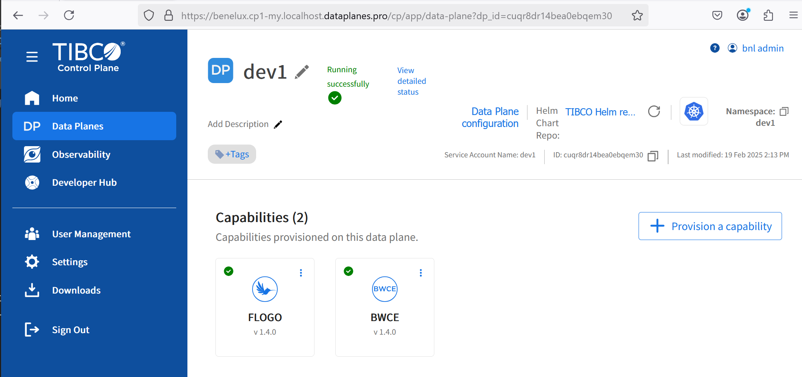
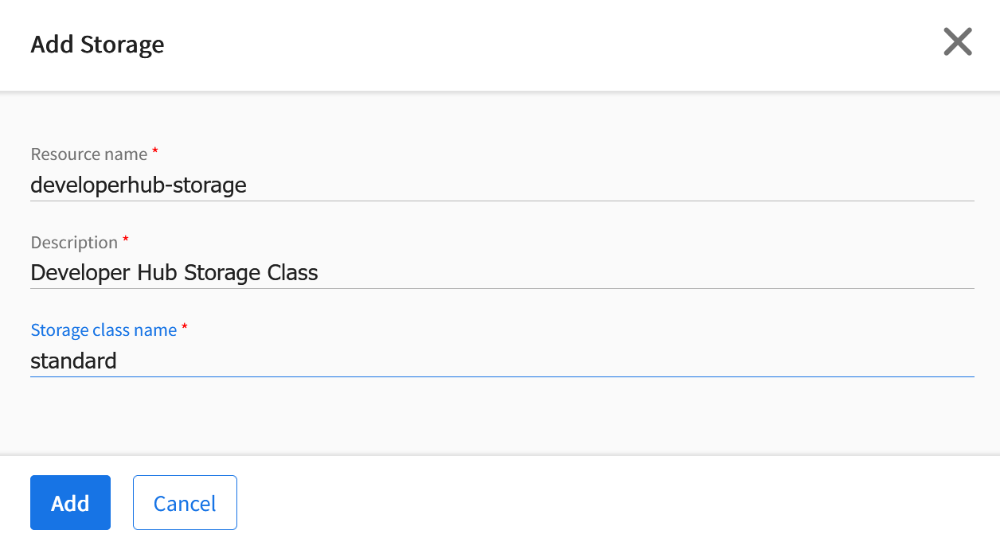
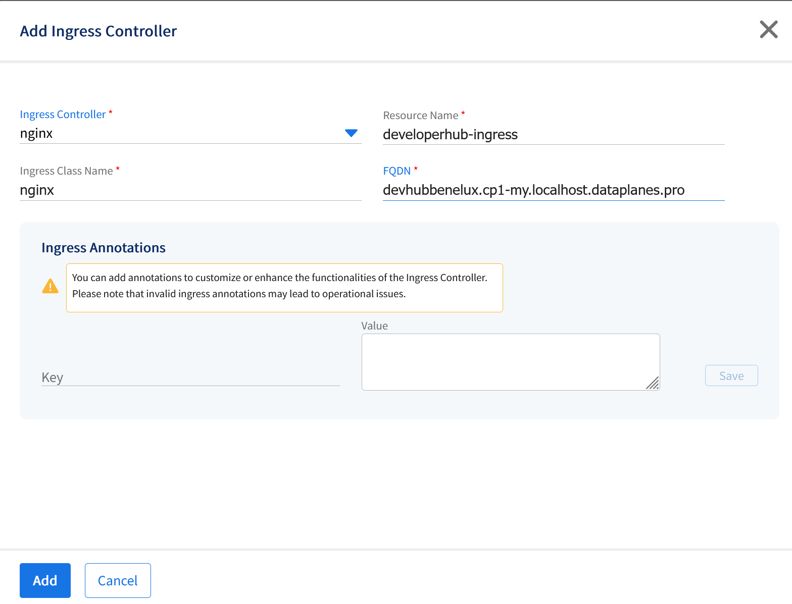
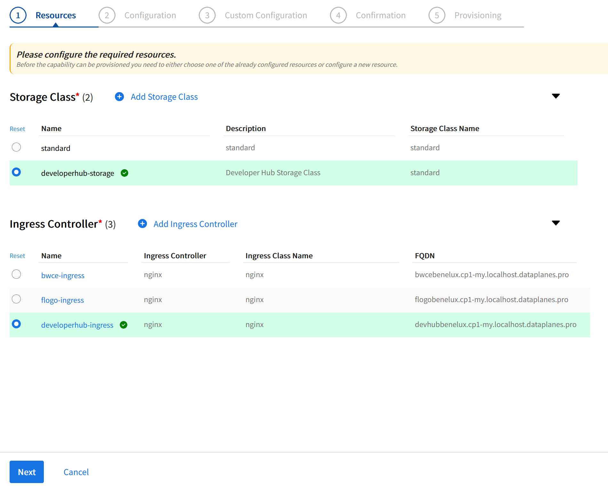
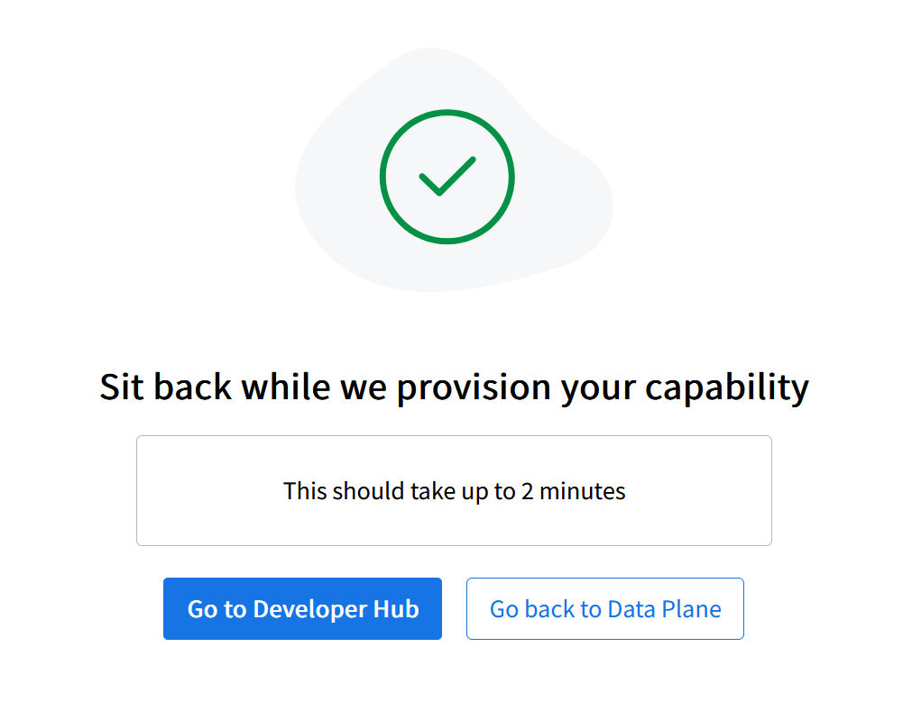

# Provision Developer Hub


## Requirements
To provision developer hub the following aspects are required:

* Active dataplane on a controlplane
* User with sufficient right on the dataplane to deploy capabilities
* command line access to update the core DNS configuration

## Provisioning

The provisioning of the developer hub involves the following steps:

1) update Core DNS with the developer hub dns entry
2) Provision Developer hub capability in dataplane via ui


## Step 1: update Core DNS with the developer hub dns entry

Retrieve the IP-address of the minikube node

```
minikube node list
```


Open coreDNS configuration for editting

```
kubectl -n kube-system edit configmaps coredns
```


Addin the host section the IP-Address found above with the dns name of the developerhub:

(example)
```
192.168.49.2 devhub.benelux.cp1-my.localhost.dataplanes.pro
```


save and exit the configmap
```
[esc]:q
```

## Step2: Provision Developer hub capability in dataplane via ui


Open the Control plan UI and access the dataplane



Click Provision a capability

Start Provision TIBCO Developer Hub

Add storage. Storage class name need to be in line with the k8s platform (minikube=standard)



Add ingress Controller.







Don't provide customer configuration and confirm.




