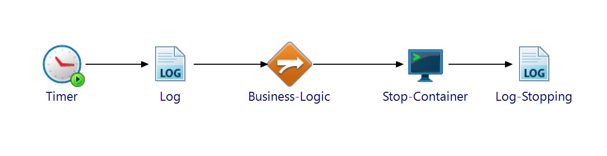

# How to execute a BusinessWorks process as cronjob in kubernetes

## Summary
In certain use cases a process requires to executed with a frequency much larger than the actual execution time of the process. For instance the process execution typically takes 1 minute while the required period between executions is one hour.
Combined with another requirement that this process cannot be combined with other processes which execution is event based it results in a container constantly running while the actual processing requirement is there for only a small percentage of time.

This how to describes how to periodically execute a BusinessWorks process periodically in a kubernetes environment without the need to keep a container running constantly.

## Apporach
A typical approach for BusinessWorks processes to execut periodically is to use a Timer start activity with a conifguration to start a process instance with a certain time interval.
This would result in the container being active also during the interval period which is not desiered.

To prevent this this solution used three main principles:
1) A kubernetes cronjob will offer the functionality to periodically start the container
2) The BusinessWorks process starts upon start of the container by means of a Timer activity, but with a 'run onces' configuration. 
3) Once  the business logic has been executed by the BusinessWorks process will, it will end the active process thread inside the container, causing the container to stop.

By implementing these three principles, with the correct configuration, we can accief the goal of this document.

## Implementation BusinessWorks

First we will describe the BusinessWorks process details and the creation of the ear file.




The process has the following activities:
1) Timer activity as process starter
2) Activities implementing the business logic, here not further described
3) Activity to stop the end (kill) the active appnode process thread in the container.


### Timer activity

The timer activity needs to be configured with a 'Run Once' configuration. Since the BusinessWorks process is not responsible for perioically starting a process instance this setting needs to be set. 


### Stopping active appnode process

To stop the container in which the BW process is executing the appnode process thread in the container needs top be killed. The way the container has been setup the appnode process is the linux process with process id '1'. 
To kill this process from within the BW processes the 'External Command' activity is used.
The command executed is 'kill -s SIGINT 1'. This is configured in the Activity, General tab, element 'Command to Execute:'.
The option '-s SIGINT' will allow for the appnode to stop gracefully.


### Logging

Since the process will kill itself it means it will not leave any log entry. Therefore it is advisable to add log activities before and after the 'External Command' activity. Since the appnode is stopped gracefully any log activity after the execution of this command will still be printed in the logs.
Doing this will increase tracebility of the process.


## Implementaiton Kubernetes

Kubernetes offers the CronJob object which creates Jobs on a repeating schedule. It acts like a linux crontab line, i.e. one cronjob is like one line in a crontab configuration.

https://kubernetes.io/docs/concepts/workloads/controllers/cron-jobs/

### CronJob Yaml

This section describes the CronJob Yaml file and configuration to accief certain behavior.

``` yaml
apiVersion: batch/v1
kind: CronJob
metadata:
  name: pod-cronjob
spec:
  schedule: "0 * * * *"
  jobTemplate:
    spec:
      ttlSecondsAfterFinished: 10
      backoffLimit: 0
      template:
        spec:
          containers:
          - name: pod-stopper
            image: pod-stopper:3
            imagePullPolicy: Never
          restartPolicy: Never
      podFailurePolicy:
        rules:
        - action: FailJob
          onExitCodes:
            containerName: pod-stopper
            operator: In
            values: [130]
        - action: FailJob
          onExitCodes:
            containerName: pod-stopper
            operator: NotIn
            values: [0, 130]
```

<br><br>

|configuration|purpose|
|-|-|
|metadata.name|name of the CronJob object|
|spec.schedule|schedule of execution of the job|
|spec.jobTemplate.spec.ttlSecondsAfterFinished|duration in seconds before the failed job gets cleaned up, including the pod and container|
|spec.jobTemplate.spec.backoffLimit|number time k8s tries to restart a failing pod|
|spec.jobTemplate.spec.template.spec.containers.name|name of the container to be executed|
|spec.jobTemplate.spec.template.spec.containers.image|name of the container image (bw container with ear file) to be executed|
|spec.jobTemplate.spec.template.spec.containers.imagePullPolicy|specifies when kubelet tries to pull the container image|
|spec.jobTemplate.spec.template.spec.restartPolicy|specifies when kubelet tries restart a failing pod|
|spec.jobTemplate.spec.podFailurePolicy.rules.action.onExitCodes|section specifies what type of action to treat on certain exit codes |


The above sample yaml has been configure to implement the use case in this document: 'The process must be executed periodically (every hour) and once it has completed execuring its business logic the pod/container hosting this process should be removed. A new one should be started only based on the periodic schedule' 

This is implemented by:
* Schedule: spec.schedule: "0 * * * *" (here every minute, for testing purposes)
* Assure the Pod failure, initiated by the kill action in the BW process, is threated as a FailJob status. This kill action results in a POD result code '130'.This will enable the below conifguration not to restart the pod: 'podFailurePolicy.rules'
* Don't restart pod/container automatically (K8S will try this by default):  'ttlSecondsAfterFinished: 10', 'backoffLimit: 0'  and 'restartPolicy: Never'


### Schedule

The schedule to be configured is a crontab style schedule:

 ┌───────────── minute (0 - 59)<br>
 │ ┌───────────── hour (0 - 23)<br>
 │ │ ┌───────────── day of the month (1 - 31)<br>
 │ │ │ ┌───────────── month (1 - 12)<br>
 │ │ │ │ ┌───────────── day of the week (0 - 6) (Sunday to Saturday)<br>
 │ │ │ │ │                                   OR sun, mon, tue, wed, thu, fri, sat<br>
 │ │ │ │ │<br>
 │ │ │ │ │<br>
\* * * * * *<br>

Other than the standard syntax, some macros like @monthly can also be used:

|Entry|Description|	Equivalent to|
|-|-|-|
|@yearly (or @annually)|Run once a year at midnight of 1 January|	0 0 1 1 *|
|@monthly|Run once a month at midnight of the first day of the month|	0 0 1 * *|
|@weekly	|Run once a week at midnight on Sunday morning|	0 0 * * 0|
|@daily (or @midnight)	|Run once a day at midnight	|0 0 * * *|
|@hourly	|Run once an hour at the beginning of the hour	|0 * * * *|


## sample setup

In the folder [text](cronjob) an example of the BW project, Dockerfile to create the app container image and the cronjob.yaml file can be found.

The creation of the contianer image requires the BWCE base container image to be created. For this see the [documentation](https://docs.tibco.com/pub/activematrix_businessworks/6.12.0/doc/bwce-html/Default.htm#app-dev-guide/creating-the-bwce-ba2.htm?TocPath=Application%2520Development%257CApplication%2520Development%2520for%2520Docker%257C_____3)

To use it follow below steps:
(steps 1, 2 and 3 can be skipped is one want to directly use the included ear file instead of building it)
<br>

1) open TIBCO BusinessStudio, create a new workspace and import the BW projects in the file StopMyself.zip
2) Inspect the process StopMyself.module\Processes\stopmyself\module\StopProcess.bwp for the implementation in the process.
3) Build the ear file (name it 'StopMyself_1.0.0.ear')
<br>

4) Copy the ear file into the same directory as the Dockerfile is located in.

5) Build the application container image by executing the command:

``` bash
docker build -t pod-stopper:3 .
```

6) Deploy the crontab object to a k8s cluster:

``` bash
kubectl apply -f cronjob.yaml
```

The CronJob will now be created. Please be aware that the creation of the first job (and thereby pod) will only be done based on the schedule provided. This, therefore, may take some time.
