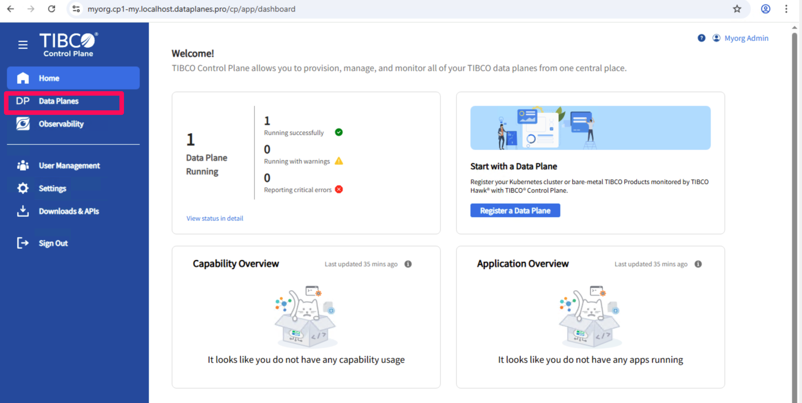

# how to add a capability

In every dataplane capabilities (integrations products) can be installed. This document contains instrutions for the addition of capabilities.

## Prerequisite
Before add a capability make sure you created a storage resource (one per Data Plane) and a Ingress controller (one per capability).
See for instructions [here](how-to-create-resources.md)

## Adding the Flogo capability

Step 1.1: Open your dataplane

Step 1.1a: Open your DataPlane

Step 1.1b: Select 'go to dataplane'

Step 1.1c: Select 'Provision a capability'

Step 1.2: Add and Configure the Flogo Capability.

Step 1.2a: Click 'Provision TIBCO Flogo Enterprise'

Step 1.2b: Add the flogo capability
Use the following input:
Storage Class: Standard
Ingress Controller: nginx-flogo

Step 1.2b: Click add and wait for the capability to be provisioned.

