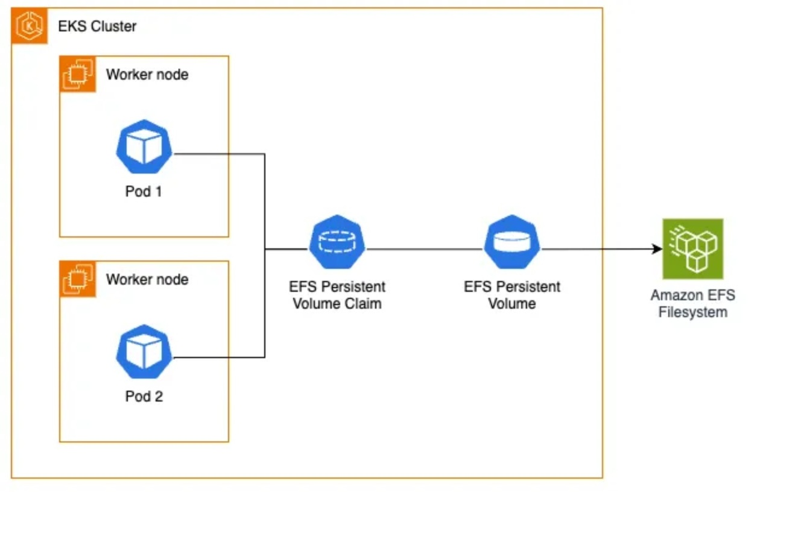

# TIBCO Software
# Control Tower


## Storage class 

Control Tower requires persistant storage. The storage class on EKS needs Elastic File Storage as provider in order for the hawk-console and msg-gateway to share the same persistant volume using SQLLite.

This section described the creation of EFS based storage in an EKS cluster.


## Environment Variables

```bash
AWS_DEFAULT_PROFILE=profilename ## change this if required,Based on local config in ~/.aws/config  
EKS_AWS_REGION=eu-west-1 ## change this if required
EKS_ACCOUNT_ID=$(aws sts get-caller-identity --query 'Account' --output text)
EKS_EKS_CLUSTER=eks-clustername ## change this if required
EKS_DP_NAMESPACE=ct-namespace ## change this if required
```

---

## Kubeconfig EKS Cluster Initialization

Update local kubeconfig to access the EKS cluster
```bash
aws eks update-kubeconfig --region $EKS_AWS_REGION --name $EKS_EKS_CLUSTER
```

Set VPC/CIDR details retrieved from EKS Cluster
```bash
EKS_VPC_ID=$(aws eks describe-cluster --name $EKS_EKS_CLUSTER --query "cluster.resourcesVpcConfig.vpcId" --region $EKS_AWS_REGION --output text)
echo "EKS_VPC_ID: $EKS_VPC_ID"
```
```bash
EKS_CIDR_BLOCK=$(aws ec2 describe-vpcs --vpc-ids $EKS_VPC_ID --query "Vpcs[].CidrBlock" --region $EKS_AWS_REGION --output text)
echo "EKS_CIDR_BLOCK: $EKS_CIDR_BLOCK"
```
``` bash
EKS_VPC_DEFAULT_SG_ID=$(aws ec2 describe-security-groups --filters "Name=vpc-id,Values=$EKS_VPC_ID" "Name=group-name,Values=default" --query "SecurityGroups[0].GroupId" --output text)
echo "EKS_VPC_DEFAULT_SG_ID: $EKS_VPC_DEFAULT_SG_ID"
```

---

---

## EFS Setup
This section describes the setup of the persistent storage based on EFS. EFS is the required type of storage on Fargate.
Only static assigned storage is permitted on Fargate.




### Create EFS File System

```bash
EKS_EFS_FS_ID=$(aws efs create-file-system   --creation-token controltower   --encrypted   --performance-mode generalPurpose   --throughput-mode bursting   --tags Key=Name,Value=ControlTowerVolume   --region $EKS_AWS_REGION   --query "FileSystemId" --output text)
echo "EKS_EFS_FS_ID: $EKS_EFS_FS_ID"
```

### Create EFS Access Point

```bash
EKS_EFS_AP=$(aws efs create-access-point   --file-system-id $EKS_EFS_FS_ID   --posix-user Uid=0,Gid=0   --root-directory "Path=/"   --region $EKS_AWS_REGION   --tags Key=Name,Value=tp-ap   --query 'AccessPointId' --output text)
echo "EKS_EFS_AP= $EKS_EFS_AP"

```

### Create Security Group and Add Ingress
The EKS cluster resources require access to the EFS services. For this port 2049 is allowed in the vpc ingress.
The access needs to be created both ingress and egress between EFS servcies and the cluster.

```bash
EKS_EFS_SG_ID=$(aws ec2 create-security-group   --description eks-controltower-ingress-egress --group-name eks-controltower   --vpc-id $EKS_VPC_ID   --region $EKS_AWS_REGION   --query 'GroupId' --output text)
echo "EKS_EFS_SG_ID: $EKS_EFS_SG_ID"
```
```bash
aws ec2 authorize-security-group-ingress   --group-id $EKS_EFS_SG_ID   --protocol tcp   --port 2049   --cidr $EKS_CIDR_BLOCK
aws ec2 authorize-security-group-egress   --group-id $EKS_EFS_SG_ID   --protocol tcp   --port 2049   --source-group $EKS_VPC_DEFAULT_SG_ID


aws ec2 describe-security-groups --group-ids $EKS_EFS_SG_ID
```

### Create Mount Targets

An EFS mount target is an NFSv4 endpoint that allows EC2 instances or Fargate tasks within a VPC to access the EFS file system.

```bash
for subnet in $(aws ec2 describe-instances --filters "Name=tag:eks:cluster-name,Values=$EKS_EKS_CLUSTER" "Name=instance-state-name,Values=running" --query "Reservations[].Instances[].SubnetId" --output text); do
    aws efs create-mount-target       --file-system-id $EKS_EFS_FS_ID       --subnet-id $subnet       --security-group $EKS_EFS_SG_ID       --region $EKS_AWS_REGION
done

aws efs describe-mount-targets --file-system-id $EKS_EFS_FS_ID
```

### Create Storage Class

``` bash
cat <<EOF | kubectl apply -f -
apiVersion: storage.k8s.io/v1
kind: StorageClass
metadata:
  name: efs-sc
provisioner: efs.csi.aws.com
parameters:
  provisioningMode: efs-ap
  fileSystemId: $EKS_EFS_FS_ID
  directoryPerms: "777"
EOF

```

### Create Persistent Volume

```bash
cat <<EOF | kubectl apply -f -
apiVersion: v1
kind: PersistentVolume
metadata:
  name: hawk-console-data-tp-dp-hawk-console-0
spec:
  capacity:
    storage: 50Gi
  volumeMode: Filesystem
  accessModes:
    - ReadWriteMany
  persistentVolumeReclaimPolicy: Retain
  storageClassName: efs-sc
  csi:
    driver: efs.csi.aws.com
    volumeHandle: $EKS_EFS_FS_ID::$EKS_EFS_AP
EOF
```
