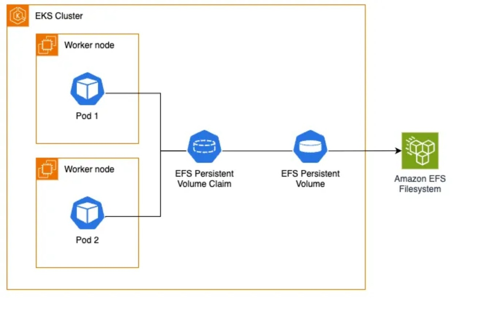

# Control Tower installation on a AWS EKS cluster - Setup Guide

## References

- [TIBCO Documentation Control Plane Overview](https://docs.tibco.com/pub/platform-cp/1.9.0/doc/html/Default.htm#Subsystems/platform-ct/user-guide/control-tower-overview.htm?TocPath=Managing%2520Control%2520Tower%2520Data%2520Planes%257C_____1)


---

## General

This guide described the setup of a Control Tower data plane on an AWS EKS cluster.
The creation of the Control Tower is initiated from the Control Plane UI (create dataplane) and excuted by a set of helm commands created during this initialisation.
Before actually creating the Control Tower first the EKS storage class needs to be created.

## Requirements

* AWS EKS cluster with worker nodes (at least 8 cpu / 32 GB total)
* EFS-CSI driver installed in cluster


## 1 Storage class 

Control Tower requires persistant storage. The storage class on EKS needs Elastic File Storage as provider in order for the hawk-console and msg-gateway to share the same persistant volume using SQLLite.

This section described the creation of EFS based storage in an EKS cluster.


## Environment Variables

```bash
AWS_DEFAULT_PROFILE={{local profile name}} ## Based on local config in ~/.aws/config 
EKS_AWS_REGION={{ aws region}} ## Region where the EKS cluster is running 
EKS_ACCOUNT_ID=$(aws sts get-caller-identity --query 'Account' --output text)
EKS_EKS_CLUSTER={{ EKS cluster name }} ## Name of EKS cluster control tower will be installed in. Can be an cluster which already contain other (TIBCO Platform) components
EKS_DP_NAMESPACE={{ Name of namespace }} ## Name of the namespace where the controltower will be deployed. Will be created during installation.
```

---

## Kubeconfig EKS Cluster Initialization

Update local kubeconfig to access the EKS cluster
```bash
aws eks update-kubeconfig --region $EKS_AWS_REGION --name $EKS_EKS_CLUSTER
```

Set VPC/CIDR details retrieved from EKS Cluster
```bash
EKS_VPC_ID=$(aws eks describe-cluster --name $EKS_EKS_CLUSTER --query "cluster.resourcesVpcConfig.vpcId" --region $EKS_AWS_REGION --output text)
echo "EKS_VPC_ID: $EKS_VPC_ID"
```
```bash
EKS_CIDR_BLOCK=$(aws ec2 describe-vpcs --vpc-ids $EKS_VPC_ID --query "Vpcs[].CidrBlock" --region $EKS_AWS_REGION --output text)
echo "EKS_CIDR_BLOCK: $EKS_CIDR_BLOCK"
```
``` bash
EKS_VPC_DEFAULT_SG_ID=$(aws ec2 describe-security-groups --filters "Name=vpc-id,Values=$EKS_VPC_ID" "Name=group-name,Values=default" --query "SecurityGroups[0].GroupId" --output text)
echo "EKS_VPC_DEFAULT_SG_ID: $EKS_VPC_DEFAULT_SG_ID"
```

---

---

## EFS Setup
This section describes the setup of the persistent storage based on EFS. EFS is the required type of storage on Fargate.
Only static assigned storage is permitted on Fargate.




### Create EFS File System

```bash
EKS_EFS_FS_ID=$(aws efs create-file-system   --creation-token controltower   --encrypted   --performance-mode generalPurpose   --throughput-mode bursting   --tags Key=Name,Value=ControlTowerVolume   --region $EKS_AWS_REGION   --query "FileSystemId" --output text)
echo "EKS_EFS_FS_ID: $EKS_EFS_FS_ID"
```
Token name can be changed as per own requirement (--cration-token)

### Create EFS Access Point

```bash
EKS_EFS_AP=$(aws efs create-access-point   --file-system-id $EKS_EFS_FS_ID   --posix-user Uid=0,Gid=0   --root-directory "Path=/"   --region $EKS_AWS_REGION   --tags Key=Name,Value=tp-ap   --query 'AccessPointId' --output text)
echo "EKS_EFS_AP= $EKS_EFS_AP"

```

### Create Security Group and Add Ingress
The EKS cluster resources require access to the EFS services. For this port 2049 is allowed in the vpc ingress.
The access needs to be created both ingress and egress between EFS servcies and the cluster.

```bash
EKS_EFS_SG_ID=$(aws ec2 create-security-group   --description eks-controltower-ingress-egress --group-name eks-controltower   --vpc-id $EKS_VPC_ID   --region $EKS_AWS_REGION   --query 'GroupId' --output text)
echo "EKS_EFS_SG_ID: $EKS_EFS_SG_ID"
```
Description can be changed as per own requirement (--description)

```bash
aws ec2 authorize-security-group-ingress   --group-id $EKS_EFS_SG_ID   --protocol tcp   --port 2049   --cidr $EKS_CIDR_BLOCK
aws ec2 authorize-security-group-egress   --group-id $EKS_EFS_SG_ID   --protocol tcp   --port 2049   --source-group $EKS_VPC_DEFAULT_SG_ID


aws ec2 describe-security-groups --group-ids $EKS_EFS_SG_ID
```

### Create Mount Targets

An EFS mount target is an NFSv4 endpoint that allows EC2 instances or Fargate tasks within a VPC to access the EFS file system.

```bash
for subnet in $(aws ec2 describe-instances --filters "Name=tag:eks:cluster-name,Values=$EKS_EKS_CLUSTER" "Name=instance-state-name,Values=running" --query "Reservations[].Instances[].SubnetId" --output text); do
    aws efs create-mount-target       --file-system-id $EKS_EFS_FS_ID       --subnet-id $subnet       --security-group $EKS_EFS_SG_ID       --region $EKS_AWS_REGION
done

aws efs describe-mount-targets --file-system-id $EKS_EFS_FS_ID
```

### Create Storage Class

``` bash
cat <<EOF | kubectl apply -f -
apiVersion: storage.k8s.io/v1
kind: StorageClass
metadata:
  name: efs-sc
provisioner: efs.csi.aws.com
parameters:
  provisioningMode: efs-ap
  fileSystemId: $EKS_EFS_FS_ID
  directoryPerms: "777"
EOF

```

### Create Persistent Volume

```bash
cat <<EOF | kubectl apply -f -
apiVersion: v1
kind: PersistentVolume
metadata:
  name: hawk-console-data-tp-dp-hawk-console-0
spec:
  capacity:
    storage: 50Gi
  volumeMode: Filesystem
  accessModes:
    - ReadWriteMany
  persistentVolumeReclaimPolicy: Retain
  storageClassName: efs-sc
  csi:
    driver: efs.csi.aws.com
    volumeHandle: $EKS_EFS_FS_ID::$EKS_EFS_AP
EOF
```

This completes the setup of the storage for Control tower.

---


## 2 Create dataplane

In the Control Plane UI follow the below procedure:<br>

- Click 'Data Planes'<br>
- Click 'Register a Data Plane' <br>
- Click 'Control Tower Data Plane' Start<br>
This opens the Setup Control Tower wizard:<br>
<br>

- Data Plane Details:<br>
    > 'Data Plane Name': name of the data plane to be used for Control Tower<br>
    > 'Description' : description of the data plane, will be displayed on the data plane overview page<br>
    > 'Machine Host Name' : the fqdn used for the ingress into the dataplane<br>
    > 'I have read and accepted the TIBCO EUA': check this<br>
    > Click 'Proceed with Advanced Configuration' <br>

- Namespace & Service Account:<br>
    > 'Namespace': name of the namespace to be used for the control tower deployment (will be created)<br>
    > 'Service Account': name of the service account to be used for the control tower deployment (will be created)<br>
    > Click 'Next' <br>

- Resources:<br>
    Storage Class:<br>
    > Resource Name:  name of the storageclass (change as per liking)<br>
    > Description:  description (change as per liking)<br>
    > Storage Class Name: use the name of the storage class created in the previous section.<br>
    > Click 'Next' <br>

    Ingress Controller:<br>
    > Ingress Controller: nginx<br>
    > Resource Name: name of the resource. <br>
    > Ingress Class name: This should be the same as the main nginx ingress of the K8S cluster if there is already a running data plane running on this K8S cluster. <br>
    > hostname.tibco.com<br>
    > FQDN: prepopulated based on 'Machine Host Name' provided on the Data Plane Detais screen.<br>
    > Click 'Next' <br>

- Configuration:<br>
    > Details on this page are usually used as per default settings (originating from the CP configuration)<br>
    > Click 'Next' <br>

- Preview:<br>
    > Check all information provided<br>
    > Click 'Register on Control Plane' <br>
<br>
Now Click 'Display Details & Registration Commands'.

Execute the 4 provided commands against the K8S cluster to create the 'Control Tower' Data Plane
Wait a few minutes for all the deployments to complete and pods to startup.


## 3 Add BW5 domain to Control Tower

Open the Control Tower dataplane, click on 'Data Plane Configuration'.
On the domain Tab Click Add Domain.

- 'Add Domains details'.
> Domain name: name of the existing BW5 domain<br>
> Transport: Select EMS or RV based on the domain communication within the domain uses.<br>
EMS: provide the ems details of the ems server used for domain communication<br>
> EMS Server URL<br>
> EMS Username<br>
> EMS Password<br>

RV: <br>
> Hawk RV service: port number of the Hawk RV service on the BW5 server<br>
> Hawk RV Network: name of the Hawk RV Network on the BW5 server<br>
> Hawk RV Daemon: rv daemon connection string (i.e. tcp://<bw server>:<rv deamon port>)<br>

Click 'Add Domain' 

This will conect the Control Tower to the BW domain. After a while domain details will become visible in the Control Tower Data Plane.


## 4 BW5 app configuration

To enable the BW5 application to start producing metrics and traces some additions to the bw tra file need to be made.

```java.property.bw.engine.opentelemetry.enable=true
java.property.otel.exporter.otlp.traces.protocol=http/protobuf
java.property.bw.engine.opentelemetry.disableAutoConfiguration=false
java.property.bw.engine.opentelemetry.span.exporter=OTLP-HTTP
java.property.bw.engine.opentelemetry.traces.enable=true
java.property.otel.exporter.otlp.traces.endpoint=https://{{ FQDN }}/tibco/agent/o11y/{{ dataplaneid}}/traces
java.property.bw.engine.opentelemetry.metrics.enable=true
java.property.otel.exporter.otlp.metrics.protocol=http/protobuf
java.property.otel.exporter.otlp.metrics.endpoint=https://{{ FQDN }}/tibco/agent/o11y/{{ dataplaneid}}/metrics
```


Update the {{ FQDN }} with the 'Machine Host Name' as provided during the Register data plane procedure in CP UI.
Update the {{ dataplaneid}} with the dataplanid created for the control tower.

These properties need to be added in the file $TIBCO_HOME/bw/5.16/bin/bwengine.tra . After this any application being deployed will have these properties.
For existing deployed applications these properties need to be added by either: <br>
1) update the application .tra file in the domain/application directory and restart it.
2) perform a forced deployment

