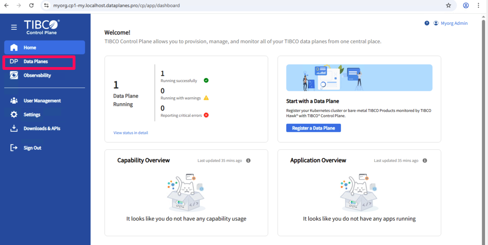
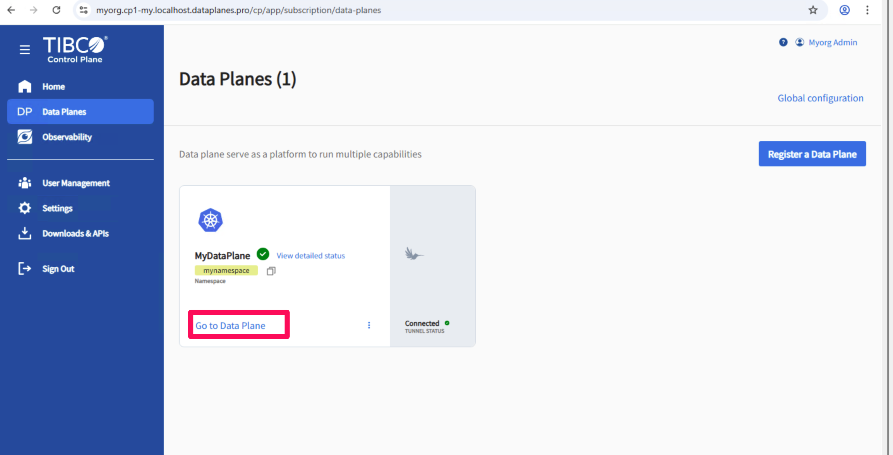
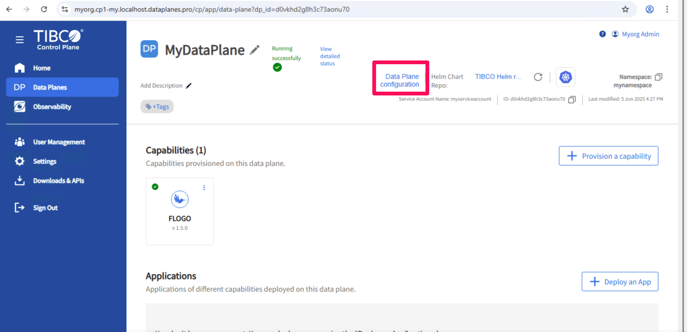
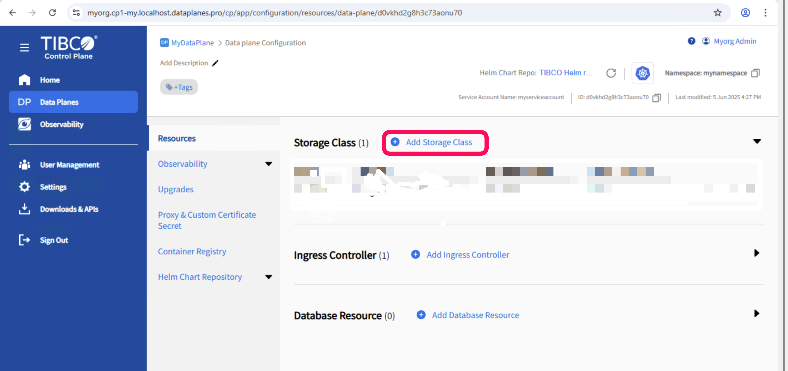
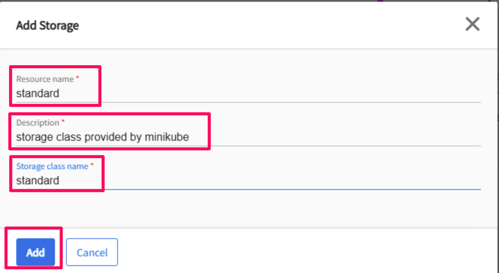
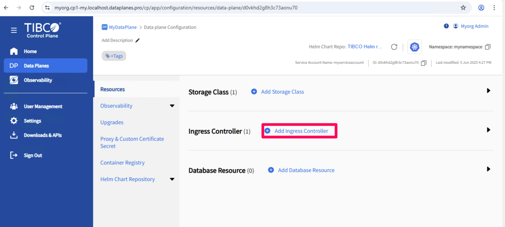
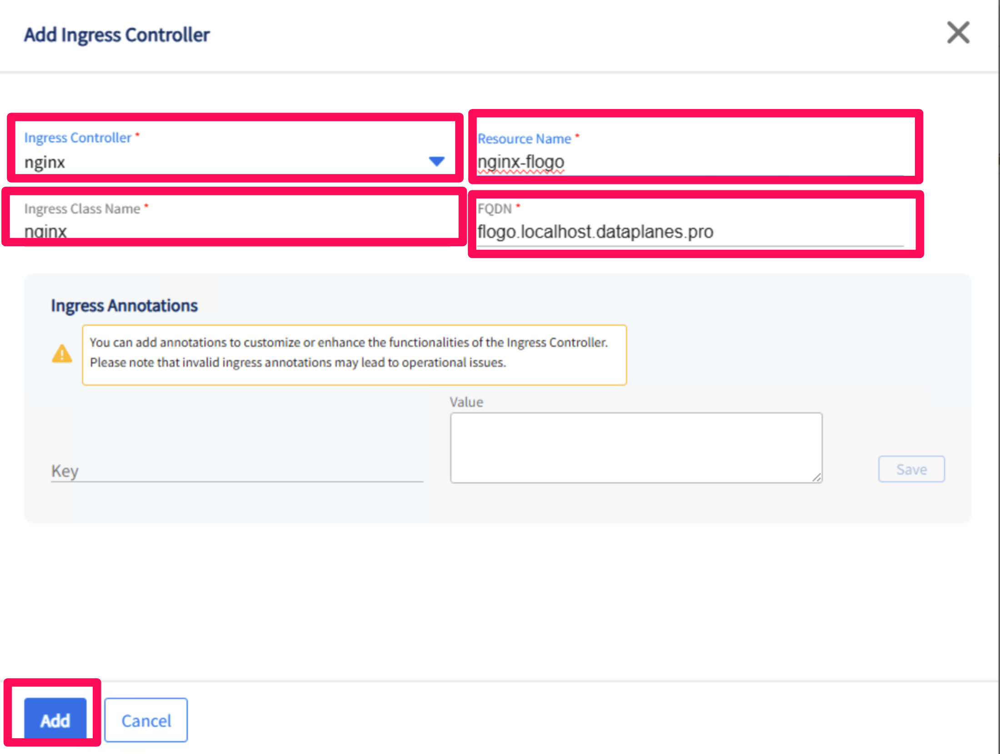

# how to create resources

Every Data Plane has so-called resources:
- Storage
- Ingress Controllers
- Databases

If you want to use any of these (which is for example required when adding a capability), you first have to add the resources. This document contains instructions on creating Storage and Ingress Controllers.

## Step 1: Adding storage
Applications require storage. Within minikube one type of storage is available (standard). Before creating capabilities, a storage resource must be added using the following steps:

Step 1.1: Open your dataplane

Step 1.1a: Open your DataPlane

Step 1.1b: Select 'go to dataplane'

Step 1.1c: Select 'Dataplane configuration'

Step 1.2: Add storage class

Step 1.2a: Click 'Add storage class'

Step 1.2b: Create a storage class with the following values:
Resource Name: standard
Description: Storage Class Provided by MiniKube
Storage Class Name: standard

## Step 2: Create an Ingress Controller
For every capability one Ingress controller needs to be created. 

Step 2.1: Repeat step 1.1.

Step 2.2: Add ingress controller

Step 2.2a: Click 'Click 'Add Ingress Controler'

Step 2.2b: Click 'Click 'Add Ingress Controler'

Ingress Controller: nginx
Ingress Class Name: nginx
Resourcename: nginx-{capability}. For example: nginx-flogo
FQDN: {capability}.localhost.dataplane.pro. For example: flogo.localhost.datapane.pro

