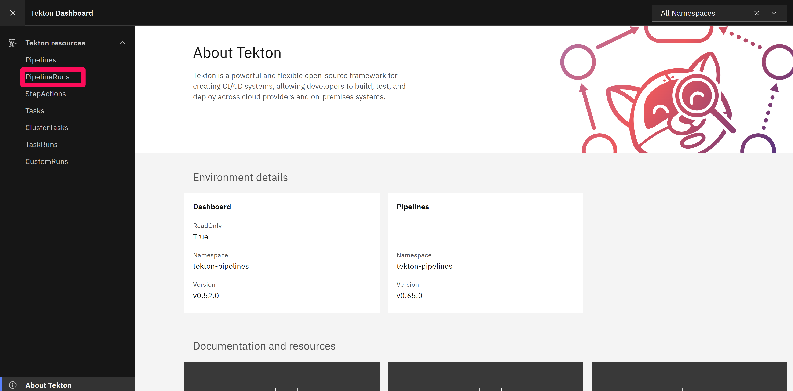
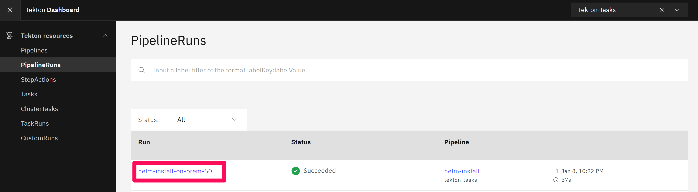
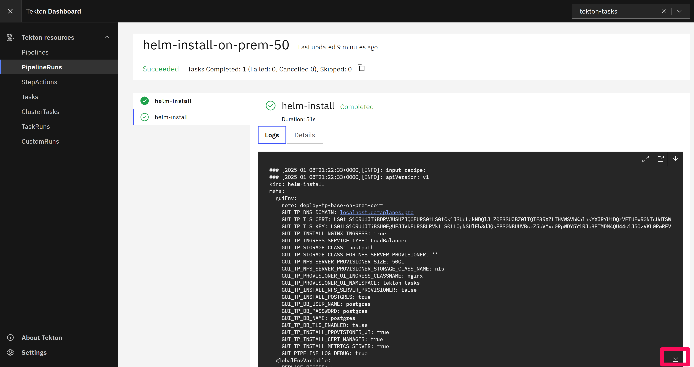

# Install the TIBCO control plane + data plane on Docker Desktop on WSL

This document contains a description to install the control plane + data plane on Docker Desktop for WSL


## Step 1: start the WSL Ununtu image

Step 1.1: Open a windows terminal and run the following command

command:
```windows terminal
wsl -d Ubuntu-22.04
```

You will be transferred to a terminal that runs on the basic Ubuntu WSL image. All commands from this moment in time are carried out on this Linux terminal.


Step 1.2: Go to the directory ~/tibcoplatform

b) Go to your home directory
```bash
cd ~/tibcoplatform
```

## Step 2: Clone the required repositories
The required scripts are stored in the following repositories:
- https://github.com/mcommiss-tibco/platform-provisioner.git 
- https://github.com/tibco-bnl/workshop-tibco-platform 

Clone these repositories with the following commands
```bash
git clone https://github.com/mcommiss-tibco/platform-provisioner.git 
git clone https://github.com/tibco-bnl/workshop-tibco-platform
```

## Step 3: Make a couple of changes to the receipts

Step 3.1: Start Visual Studio

From the directory ~/tibcoplatform in which you cloned the repository, run the following command.

```bash
code . 
```

Step 3.2: Configure the directory from which the installation will take place

Open the file ~/tibcoplatform/workshop-tibco-platform/scripts/run_platform_provisioner.sh in Visual Studio and set PP_GIT_DIR to ~/tibcoplatform

Result
```bash
PP_GIT_DIR=~/tibcoplatform 
```

Step 3.3: Set the TLS keys to be used for the communication between the CP and the DP
Open the file ~/tibcoplatform/platform-provisioner/docs/recipes/tp-base tp-base-on-prem-https-docker-desktop.yaml in Visual Studio and set the following two variables:
a) GUI_TP_TLS_CERT 
b) GUI_TP_TLS_KEY

The values will be provided by TIBCO. 
For TIBCO staff: the values can be taken from https://docs.google.com/document/d/1f39d0_L6iRpEPjJggYFJrL3oVAtDyPdVbOnjmzU7E0E/edit?tab=t.l6dihjhx60qc#heading=h.8ir76m4dmdxu

Result
```bash
GUI_TP_TLS_CERT: LS0t ...... ==
GUI_TP_TLS_KEY: LS0tLS1 ...... ==
```


Step 3.4: Set the password for the container registry.

Open the file ~/tibcoplatform/platform-provisioner/docs/recipes/controlplane/tp-cp-docker-desktop.yaml in Visual Studio and set the following variables: GUI_CP_CONTAINER_REGISTRY_PASSWORD

The value will be provided by TIBCO
For TIBCO staff: the values can be taken from https://docs.google.com/document/d/1f39d0_L6iRpEPjJggYFJrL3oVAtDyPdVbOnjmzU7E0E/edit?tab=t.l6dihjhx60qc#heading=h.8ir76m4dmdxu

Result
```bash
GUI_CP_CONTAINER_REGISTRY_PASSWORD: .....
```


## Step 4: Install the Data Plane

Step 4.1: Start the installation script

a) Run

```bash
cd ~/tibcoplatform/workshop-tibco-platform/scripts
./run_platform_provisioner.sh
```

b) Ignore the errors and enter -enter-.

A docker image will be downloaded.

c) Type 'docker-desktop' (without the quotes) when asked for the following input
----------------------------------------------------------
Available Kubernetes contexts:
docker-desktop
Enter the Kubernetes context you want to use:

d) Press -enter- on the next prompt with the following text:

Switching to docker-desktop Kubernetes context...
Switched to context "docker-desktop".
Using Docker Desktop Kubernetes context
Switched to context "docker-desktop".
Press [Enter] key to continue...

e) Press -enter- on the next prompt with the following text:

Next steps include:
1. Install TP Base
2. Install TIBCO Platform Control Plane
 You can stop this script here and create both from Platform provisioner UI as well.. which is more interactive and works well
----------------------------------------------------------
Press [Enter] key to continue...nohup: appending output to 'nohup.out'
nohup: appending output to 'nohup.out'

f) Press -enter- on the next prompt with the following text:

Install tp-base recipe
Update tp-base-on-prem-https-docker-desktop.yaml with correct values GUI_TP_TLS_CERT and GUI_TP_TLS_KEY

-DON'T PRESS ENTER AGAIN-

g) Open the Tekton GUI in you browser in windows and go to: http://127.0.0.1:9097/ . Tekton is used to install the dataplane and click 'pipeline runs'



h) Select the running pipeline



g) Check the progress of the installation task (scroll down to the bottum)



It will take 25-45 minutes for the data plane to be installed.


-ONLY PROCEED IF THE DATAPLANE WAS INSTALLED SUCCESSFULLY-

## Step 4: Install the Controll Plane

Go back to the Ubuntu WLS promt

Step 4.1 Press -enter- on the next prompt with the following text:

Install tp-base recipe
Update tp-base-on-prem-https-docker-desktop.yaml with correct values GUI_TP_TLS_CERT and GUI_TP_TLS_KEY
Press [Enter] key to continue...

Step 4.2 Press -enter- on the next prompt with the following text:

Update tp-cp-docker-desktop.yaml with correct values GUI_CP_CONTAINER_REGISTRY_PASSWORD
Press [Enter] key to continue...

-- DON'T PRESS ENTER JUST YET --

Step 4.3 Go to the tekton pipeline and check the progress of the installation task. It will take 25-45 minutes for the controll plane to be installed. Wait for it to finish

Step 4.4 Go back to the Ubuntu WLS promt and press -enter- on the next prompt

Step 4.5 Press -enter- on the following prompt:

----------------------SAVE THIS SOMEWHERE or Bookmark------------------------------------\n
All steps completed successfully. Follow Platform provisioner UI to do following:
1. Configure admin user
2. Register DP manually from CP URL and provision capabilities e.g. Flogo, BWCE, EMS, etc.
----------------------------------------------------------\n
Access the following URLs:
Mail URL: https://mail.localhost.dataplanes.pro/
CP URL: https://admin.cp1-my.localhost.dataplanes.pro/admin/app/home
Tekton Dashboard at http://localhost:9097/#/about
Platform Provisioner UI: http://localhost:8080
----------------------------------------------------------\n
Deploy TIBCO Data Plane on your docker-desktop cluster using CP
We can also use the same cluster for TIBCO Data Plane.
----------------------------------------------------------\n
To stop the port forwarding, run the following commands:
kill 22062
kill 22063
----------------------------------------------------------\n
To uninstall the platform provisioner, run the following command:
cd /home/jurriaan/tibcoplatform/platform-provisioner
./dev/platform-provisioner-uninstall.sh
----------------------------------------------------------\n


